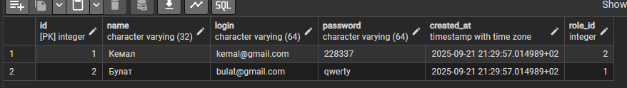
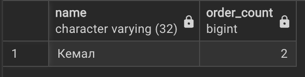
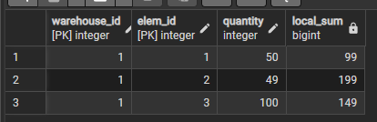
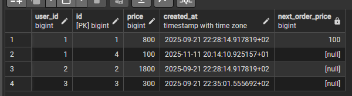
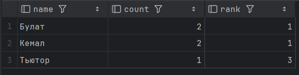
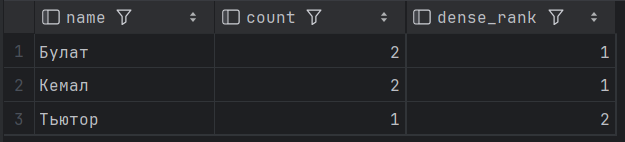
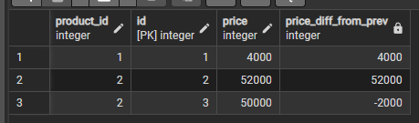

1. CTE

1.1 Вывести все элементы c количеством, которые либо есть в заказах, либо есть в корзинах.

    with elems_in_orders as (
    select distinct elem_id, quantity
    from orderelem
    ),
    elems_in_carts as (
    select distinct elem_id, quantity
    from cartelem
    )
    select * from elems_in_orders
    union
    select * from elems_in_carts;

1.2 Найти пользователей, которые и делали заказ, и добавляли товар в корзину.

    with users_with_orders as (
    select distinct user_id
    from orders
    ),
    users_with_cart as (
    select distinct user_id
    from cart
    )
    select * from users u
    where u.id in (
    select user_id from users_with_orders
    intersect
    select user_id from users_with_cart
    );

1.3 CTE, который сначала выбирает все товары (product), у которых в названии есть слово realme, а затем во внешнем запросе посчитайте общее количество таких товаров по категориям.

    WITH PhoneProducts AS (
    SELECT *
    FROM product
    WHERE name LIKE '%realme%'
    )
    select category_id, count(\*) as cnt from PhoneProducts GROUP BY (category_id);

1.4 CTE, считающий для каждого пользователя число заказов, и выберите только тех пользователей, кто сделал не менее 2 заказов.

    WITH OrderUsers AS (
    SELECT users.id as user_id, COUNT(\*) AS order_count from users join orders on users.id = orders.user_id GROUP BY (users.id)
    )
    SELECT u.name, ou.order_count from OrderUsers ou join users u on ou.user_id = u.id where ou.order_count >= 2;

1.5 Вывести юзера и общую сумму его заказов для тех у кого сумма больше 500

    with cte as (
    select user_id, sum(orders.price) as total_sum
    from orders
    group by user_id
    )
    select t.user_id, t.total_sum
    from cte t
    except
    select user_id, total_sum
    from (
    select user_id, sum(orders.price) as total_sum
    from orders
    group by user_id
    ) sub
    where total_sum < 500;

2. Over partition By

2.1 Для каждого товара (в product_element) показать его цену и среднюю цену всех элементов этого товара.

    select pe.id, pe.product_id, pe.price,
    avg(pe.price) over (partition by pe.product_id) as avg_price_in_product
    from product_element pe;

2.2 Для каждого пользователя покажите его заказы и сумму всех его заказов (используйте оконную функцию).

    SELECT user_id, users.name, price, SUM(price) 
    OVER (PARTITION BY user_id) from orders 
    join users on users.id = orders.user_id;

3. Over partition By Order By

3.1 Для каждого товара отсортировать его элементы по цене и показать накопленное количество элементов (по возрастанию цены).

    select
    pe.product_id,
    pe.id,
    pe.price,
    count(*) over (
    partition by pe.product_id
    order by pe.price
    ) as cumulative_count
    from product_element pe
    order by pe.product_id;

3.2 Для каждого заказа пользователя покажите дату заказа, сумму и накопительный итог по сумме заказов этого пользователя в порядке их создания.

    SELECT id, user_id, created_at, price,
    SUM(price) OVER (PARTITION BY user_id ORDER BY created_at) AS running_total
    FROM orders
    ORDER BY user_id, created_at;

4. Rows

4.1 Для каждого элемента на складе показать сумму количества текущего, предыдущего и следующего (в рамках одного склада)

    select
    i.warehouse_id,
    i.elem_id,
    i.quantity,
    sum(i.quantity) over (
    partition by i.warehouse_id
    order by i.elem_id
    rows between 1 preceding and 1 following
    ) as local_sum
    from inventory i
    order by i.warehouse_id, i.elem_id; 
    

4.2 Для каждого элемента в заказе показать сумму количества текущего, предыдущего и следующего (в рамках одного заказа)

    select
    orderelem.order_id,
    orderelem.elem_id,
    sum(orderelem.unit_price) over (
        partition by orderelem.order_id
        rows between 1 preceding and 1 following
        ) as local_sum
    from orderElem;

5. Range

5.1 Для каждого заказа определите среднюю стоимость соседних по времени двух предыдущих и двух последующих заказов пользователя.

    SELECT id, created_at, price,
    AVG(price) OVER (PARTITION BY user_id ORDER BY created_at RANGE BETWEEN '2 days' PRECEDING AND '2 days' FOLLOWING) 
    AS running_total FROM orders

5.2 Для каждого заказа определите среднюю стоимость соседних по времени создания двух предыдущих и двух последующих корзин пользователя.

    SELECT id, created_at, price,
    AVG(price) OVER (PARTITION BY user_id ORDER BY created_at RANGE BETWEEN '2 days' PRECEDING AND '2 days' FOLLOWING)
    AS running_total FROM cart

6. Ранжируемые функции

6.1 Пронумеровать заказы каждого пользователя по дате (первый — самый ранний).

    select
    o.user_id,
    o.id,
    o.created_at,
    row_number() over (
    partition by o.user_id
    order by o.created_at
    ) as order_num
    from orders o
    order by o.user_id, o.created_at;

6.2 Вывести топ без смещения юзеров с самым большим кол-вом заказов

    select u.name, count(u.*), rank() over (order by count(u.*) desc)
    from users u join orders o on o.user_id = u.id
    group by u.name;

6.3 Вывести топ со смещением юзеров с самым большим кол-вом заказов

    select u.name, count(u.*), dense_rank() over (order by count(u.*) desc)
    from users u join orders o on o.user_id = u.id
    group by u.name;

7. Функции смещения

7.1 Для каждого заказа пользователя показать следующую сумму заказа (по дате).

    select
    o.user_id,
    o.id,
    o.price,
    o.created_at,
    lead(o.price) over (
    partition by o.user_id
    order by o.created_at
    ) as next_order_price
    from orders o
    order by o.user_id, o.created_at;

7.2 Для каждого элемента товара показать разницу с предыдущей ценой (в рамках одного товара, по id).

    select
    pe.product_id,
    pe.id,
    pe.price,
    pe.price - lag(pe.price, 1, 0) over (
    partition by pe.product_id
    order by pe.id
    ) as price_diff_from_prev
    from product_element pe
    order by pe.product_id, pe.id

7.3 Для каждого заказа выведите реальную сумму заказа и максимальную сумму заказа пользователя.

    SELECT
    orders.id,
    users.id as users_id,
    users.name,
    price,
    LAST_VALUE(price) OVER (PARTITION BY user_id ORDER BY price ROWS BETWEEN UNBOUNDED PRECEDING AND UNBOUNDED FOLLOWING
    ) AS max_price
    FROM orders join users on orders.user_id = users.id;

7.4 Для каждого заказа выведите сумму и дату самого первого заказа пользователя

    SELECT
    orders.id,
    users.name,
    price,
    FIRST_VALUE(orders.created_at) OVER (PARTITION BY users.id ORDER BY orders.created_at) AS first_order_date
    FROM orders join users on orders.user_id = users.id ORDER BY orders.id;

