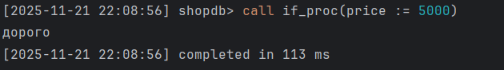
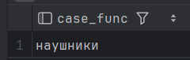
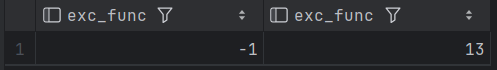
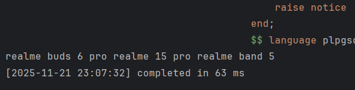
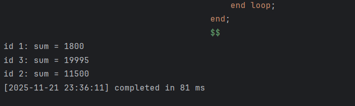

1. Procedure + raise + if

        create or replace procedure if_proc(price integer)
        language plpgsql
        as $$
        begin
        if price < 1000 then
        raise notice 'дёшево';
        else
        raise notice 'дорого';
        end if;
        end;
        $$;
        
        call if_proc(price := 5000);

2. Procedure + raise + declare + while

        create or replace procedure while_proc(amount integer)
        language plpgsql
        as $$
        declare
        i integer := 0;
        begin
        while i < amount loop
        raise notice '%', i;
        i := i + 1;
        end loop;
        end;
        $$;
        
        call while_proc(amount := 5);

3. Вывод всех процедур

        SELECT routine_schema, routine_name, routine_type
        FROM information_schema.routines
        WHERE routines.routine_type = 'PROCEDURE' and routine_schema = 'public';

4. func + case

        create or replace function case_func(product_id integer)
        returns varchar
        language plpgsql
        as $$
        begin
        case
        when product_id = 2 then return 'телефон';
        when product_id = 1 then return 'наушники';
        when product_id = 3 then return 'часы';
        else return '';
        end case;
        end;
        $$;
        
        select case_func((select P.id from product_element pe
        join Product P on P.id = pe.product_id
        where pe.article_num = 11));

5. func + exception + declare

        create or replace function exc_func(amount integer)
        returns integer
        language plpgsql
        as $$
        declare
        const integer := 12;
        begin
        if amount = 0 then raise exception restrict_violation;
        else return const + amount;
        end if;
        exception
        when restrict_violation then
        return -1;
        end;
        $$;
        
        select exc_func(0), exc_func(1);

6. Вывод всех функций

        SELECT routine_schema, routine_name, routine_type
        FROM information_schema.routines
        WHERE routines.routine_type = 'FUNCTION' and routine_schema = 'public';

7. do + exception

        do $$
        begin
        raise notice '%', 1/0;
        exception
        when division_by_zero then raise notice 'на ноль не делится ващето';
        end;
        $$ language plpgsql;

8. do + declare + while

        do $$
        declare
        sum varchar = '';
        i integer = 0;
        name_p varchar = '';
        begin
        while i < 5 loop
        i := i + 1;
        select name into name_p from product where id = i;
        sum := sum || ' ' || coalesce(name_p, '');
        end loop;
        raise notice '%', sum;
        end;
        $$ language plpgsql;

        
9. proc

        create procedure set_discount(order_item_id integer, new_discount integer)
        language plpgsql
        as $$
        begin
        update orderelem
        set discount = new_discount
        where id = order_item_id;
        END;
        $$;
        
        call set_discount(1, 15);

10. func

        create or replace function get_order_total(order_id_attr integer)
        returns integer
        language plpgsql
        as $$
        declare
        total integer := 0;
        begin
        select sum(quantity * unit_price)
        into total
        from orderelem
        where order_id = order_id_attr;
        return coalesce(total, 0);
        end;
        $$;
        
        select get_order_total(order_id_attr := 1);

11. do

        do $$
        declare
        idd integer;
        sumd integer;
        begin
        for idd, sumd in
        select order_id, sum(quantity * unit_price) as total
        from orderelem
        group by order_id
        loop
        raise notice 'id %: sum = %', idd, sumd;
        end loop;
        end;
        $$;

