1. COUNT()

  1.1 Для таблицы orders — подсчитать, сколько заказов совершил каждый пользователь.

    SELECT users.name, count(*) AS cn FROM orders 
    INNER JOIN users ON orders.user_id = users.id 
    GROUP BY users.name

  1.2 Вывести количество корзин для каждого юзера

    select u.name, count(*) as count from cart c
    join users u on c.user_id = u.id
    group by u.name;

2. SUM()

  2.1 Для таблицы cart — найти общую стоимость товаров в корзине для каждого пользователя.

    SELECT users.name, sum(cart.price) AS sm FROM cart 
    INNER JOIN users ON cart.user_id = users.id 
    GROUP BY users.name

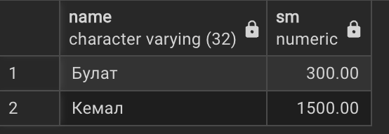

  2.2 Вывести пользователей с их оплаченной суммой

    select u.name, sum(o.price) from payment p
    join orders o on p.order_id = o.id
    join users u on o.user_id = u.id
    where p.status = 'paid'
    group by u.name;

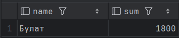

3. AVG()

  3.1 Для таблицы product_element — вычислить среднее всех товаров
        
    SELECT AVG(price) AS avg_price FROM product_element

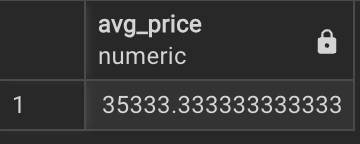

  3.2 Вывести среднюю цену для категории

    select c.name, avg(Pe.price) from category c
    join Product P on c.id = P.category_id
    join Product_element Pe on P.id = Pe.product_id
    group by c.name;

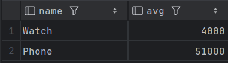

4. MIN()

  4.1 Для таблицы inventory — определить наименьший запас товара в каждом складе.
    
    SELECT warehouse.name, MIN(inventory.quantity) as mn FROM warehouse
    INNER JOIN inventory ON inventory.warehouse_id = warehouse.id
    GROUP BY warehouse.name

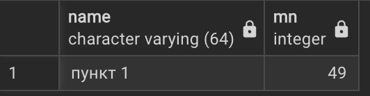

  4.2 Вывести юзеров с минимальным количеством товара в корзине

    select u.name, min(ce.quantity) as max from cartelem ce
    join cart c on c.id = ce.cart_id
    join users u on u.id = c.user_id
    group by u.name;

5. MAX()

  5.1 Для таблицы payment — найти максимальную сумму оплаты среди всех транзакций.
    
    SELECT payment.transaction_id, MAX(orders.price) as mx FROM payment
    INNER JOIN orders ON payment.order_id = orders.id
    ORDER BY orders.total_price DESC LIMIT 1

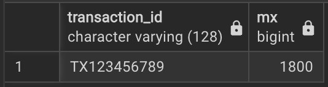

  5.2 Вывести максимальное количество товаров на складах

    select w.name, max(i.quantity) as mn from warehouse w
    join inventory i ON i.warehouse_id = w.id
    group by w.name;

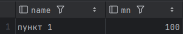

6. STRING_AGG()

  6.1 Для таблицы category — собрать все названия продуктов этой категории в одну строку через запятую.

    SELECT category.name, STRING_AGG(product.name, ', ') AS product_names FROM category 
    INNER JOIN product ON category.id = product.category_id 
    GROUP BY category.name

  6.2 Для товара вывести все возможные артикулы

    select pe.article_num from orderelem o
    join product_element pe on pe.id = o.elem_id
    group by pe.article_num;

7. GROUP_BY

  7.1 Для таблицы cartelem — выбрать идентификаторы корзин, в которых количество уникальных элементов больше одного.

    SELECT cartelem.cart_id FROM cartelem 
    INNER JOIN product_element ON cartelem.elem_id = product_element.id
    GROUP BY cartelem.cart_id HAVING count(product_element.id) > 1

  7.2 Вывести артикул и количество в заказах

    select pe.article_num, sum(o.quantity) from orderelem o
    join product_element pe on pe.id = o.elem_id
    group by pe.article_num;

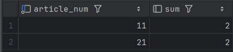

8. HAVING

  8.1 Для таблицы payment — выбрать способы оплаты, по которым было совершено более 0 транзакций.
    
    SELECT method, COUNT(*) AS transactions_count FROM payment
    GROUP BY method HAVING COUNT(*) > 0;

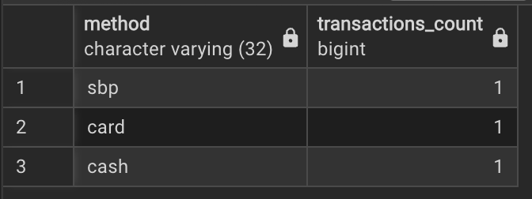

  8.2 Выбрать продукт и сумму всех его типов, где сумма больше 10000.

    select P.name, sum(price)
    from product_element pe
    join Product P on pe.product_id = P.id
    group by P.name
    having sum(price) > 10000;

9. GROUPING SETS

  9.1 Для таблицы orders — посчитать количество заказов для каждой комбинации статуса и метода доставки, а также отдельно по статусу и отдельно по методу доставки.

    SELECT orders.status, delivery_point.method, COUNT(*) AS cnt FROM orders 
    INNER JOIN delivery_point ON orders.delivery_point_id = delivery_point.id 
    GROUP BY GROUPING SETS ((orders.status, delivery_point.method), (orders.status), (delivery_point.method));

  9.2 Вывести метод и для него сумму, а также сумму всех методов.

    select dp.method, sum(o.price) AS sum from orders o
    join delivery_point dp on dp.id = o.delivery_point_id
    group by grouping sets ((dp.method), ());

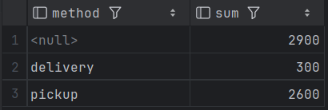

10. ROLLUP

  10.1 Для таблицы orderelem — вычислить общую, по каждому товару, и итоговую сумму продаж по элементам заказа.
    
    SELECT cartelem.elem_id, SUM(cartelem.quantity * product_element.price) AS sm 
    FROM cartelem 
    INNER JOIN product_element ON cartelem.elem_id = product_element.id 
    GROUP BY ROLLUP(cartelem.elem_id)

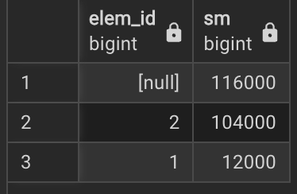

  10.2 Группировать количество по имени/id, имени категории, а также найти общее количество заказов

    select c.name, c.id, sum(oe.quantity) AS qty
    from public.orderelem oe
    join public.product_element pe on pe.id = oe.elem_id
    join public.product p on p.id = pe.product_id
    join public.category c on c.id = p.category_id
    group by rollup (c.name, c.id)
    order by id, name nulls last;

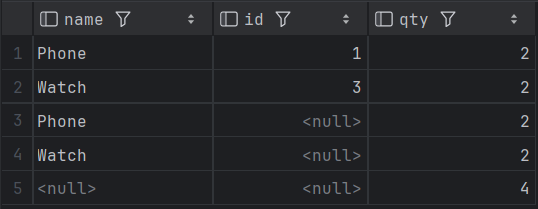

11. CUBE

  11.1 Для таблицы inventory — посчитать итоговые и покомпонентные остатки товаров для каждой комбинации склада и товара.

    SELECT warehouse.name, product.name, SUM(inventory.quantity) AS sm 
    FROM inventory 
    INNER JOIN warehouse ON inventory.warehouse_id = warehouse.id 
    INNER JOIN product_element ON inventory.elem_id = product_element.id 
    INNER JOIN product ON product_element.product_id = product.id 
    GROUP BY CUBE(warehouse.name, product.name) ORDER BY sm DESC;

  11.2 Группировать по статусу, методу оплаты, а также только по статусу, только по методу и найти количество всевозможных оплат

    select o.status, pay.method AS pay_method,count(*) AS orders_cnt
    from public.orders o
    join public.payment pay on pay.order_id = o.id
    group by cube (o.status, pay.method)
    order by o.status nulls last , pay_method nulls last;

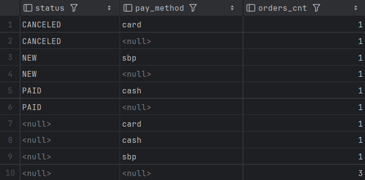

12. SELECT, FROM, WHERE, GROUP BY, HAVING, ORDER BY

  12.1 Для таблицы users — получить список пользователей, сгруппированных по роли, которые зарегистрировались после определённой даты, подсчитать количество таких пользователей в каждой роли, оставить только те роли, где их больше двух, и отсортировать по количеству по убыванию и имени роли по возрастанию.

    SELECT role.name as user_role, COUNT(*) AS user_count 
    FROM users INNER JOIN role ON users.role_id = role.id 
    WHERE EXTRACT(YEAR FROM users.created_at) > 2024 
    GROUP BY role.name HAVING COUNT(*) > 1 
    ORDER BY user_count DESC, role.name ASC;

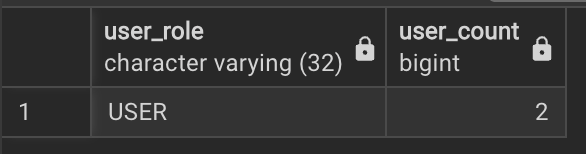

  12.2 Вывести категорию и общую сумму заказа для каждого юзера, где оплатить не удалось, с суммой меньше 1500, вывести самую такую большую сумму.
  
    select c.name AS category_name, sum(oe.quantity * oe.unit_price) as sum
    from orderelem oe
    join orders o on o.id = oe.order_id
    join payment pay on pay.order_id = o.id
    join product_element pe on pe.id = oe.elem_id
    join product p on p.id = pe.product_id
    join Category C on p.category_id = C.id
    where pay.status='failed'
    group by c.name
    having sum(oe.quantity * oe.unit_price) < 1500
    order by sum desc
    limit 1;

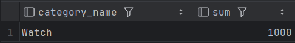
