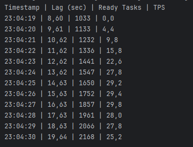
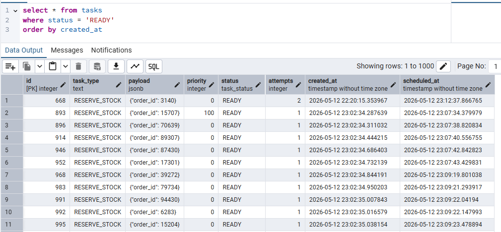
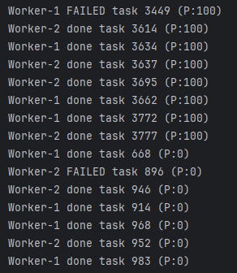
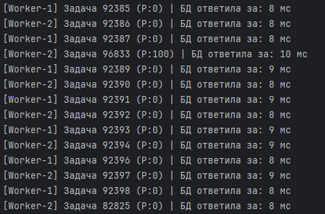
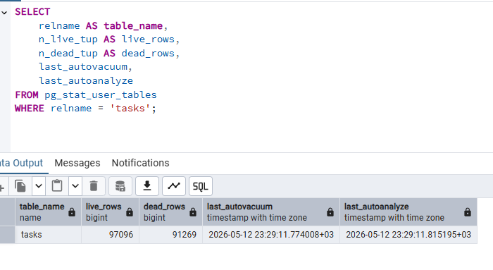
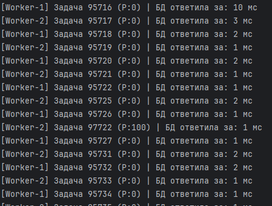

# Создание таблицы
```sql
CREATE TABLE tasks (
    id SERIAL PRIMARY KEY,
    task_type TEXT NOT NULL,
    payload JSONB,
    priority INTEGER DEFAULT 0,
    status VARCHAR(15) DEFAULT 'READY',
    attempts INTEGER DEFAULT 0,
    created_at TIMESTAMP DEFAULT NOW(),
    scheduled_at TIMESTAMP DEFAULT NOW()
);

CREATE INDEX idx_tasks_fetch ON tasks (priority DESC, scheduled_at ASC) 
WHERE status = 'READY';
```
# Java скрипт
```java
import java.sql.*;
import java.util.Random;
import java.util.concurrent.ExecutorService;
import java.util.concurrent.Executors;

public class Main {
    private static final String DB_URL = "jdbc:postgresql://localhost:5432/shopdb";
    private static final String USER = "postgres";
    private static final String PASS = "postgres";

    public static void main(String[] args) throws InterruptedException {
        new Thread(() -> runProducer(200)).start();

        ExecutorService consumers = Executors.newFixedThreadPool(2);
        consumers.submit(() -> runConsumer("Worker-1"));
        consumers.submit(() -> runConsumer("Worker-2"));
    }

    private static void runProducer(int targetIps) {
        Random rand = new Random();
        try (Connection conn = DriverManager.getConnection(DB_URL, USER, PASS)) {
            while (true) {
                conn.setAutoCommit(false);
                try (PreparedStatement bizLogic = conn.prepareStatement(
                        "UPDATE inventory SET quantity = quantity - 1 WHERE elem_id = ? AND warehouse_id = ?;");
                     PreparedStatement insertTask = conn.prepareStatement(
                             "INSERT INTO tasks (task_type, priority, payload) VALUES (?, ?, ?::jsonb)")) {
                    bizLogic.setInt(1, 6);
                    bizLogic.setInt(2, rand.nextInt(2, 4));
                    bizLogic.executeUpdate();

                    int priority = (rand.nextInt(100) < 20) ? 100 : 0;
                    insertTask.setString(1, "RESERVE_STOCK");
                    insertTask.setInt(2, priority);
                    insertTask.setString(3, "{\"order_id\": " + rand.nextInt(100000) + "}");
                    insertTask.executeUpdate();

                    conn.commit();

                    try (Statement s = conn.createStatement()) {
                        s.execute("NOTIFY task_event");
                    }
                } catch (SQLException e) {
                    conn.rollback();
                    e.printStackTrace();
                }
                Thread.sleep(1000 / targetIps);
            }
        } catch (Exception e) {
            e.printStackTrace();
        }
    }

    private static void runConsumer(String workerName) {
        try (Connection conn = DriverManager.getConnection(DB_URL, USER, PASS)) {
            try (Statement s = conn.createStatement()) {
                s.execute("LISTEN task_event");
            }

            while (true) {
                boolean foundTask = true;
                while (foundTask) {
                    foundTask = processTask(conn, workerName);
                }
                Thread.sleep(1000);
            }
        } catch (Exception e) {
            e.printStackTrace();
        }
    }

    private static boolean processTask(Connection conn, String workerName) throws SQLException {
        String selectSql = """
            UPDATE tasks
            SET status = 'RUNNING'
            WHERE id = (
                SELECT id FROM tasks
                WHERE status = 'READY' AND scheduled_at <= NOW()
                ORDER BY priority DESC, created_at ASC
                FOR UPDATE SKIP LOCKED
                LIMIT 1
            )
            RETURNING id, priority, attempts;
            """;

        try (PreparedStatement ps = conn.prepareStatement(selectSql)) {
            ResultSet rs = ps.executeQuery();
            if (rs.next()) {
                int id = rs.getInt("id");
                int priority = rs.getInt("priority");
                int attempts = rs.getInt("attempts");

                try {
                    Thread.sleep(50);
                } catch (InterruptedException e) {}

                if (new Random().nextInt(100) < 5) {
                    failTask(conn, id, attempts);
                    System.out.println(workerName + " FAILED task " + id + " (P:" + priority + ")");
                } else {
                    completeTask(conn, id);
                    System.out.println(workerName + " done task " + id + " (P:" + priority + ")");
                }
                return true;
            }
        }
        return false;
    }

    private static void completeTask(Connection conn, int id) throws SQLException {
        try (PreparedStatement ps = conn.prepareStatement("UPDATE tasks SET status = 'COMPLETED' WHERE id = ?")) {
            ps.setInt(1, id);
            ps.executeUpdate();
        }
    }

    private static void failTask(Connection conn, int id, int attempts) throws SQLException {
        String sql = "UPDATE tasks SET status = 'READY', attempts = attempts + 1, " +
                "scheduled_at = NOW() + interval '5 minutes' * (attempts + 1) WHERE id = ?";
        try (PreparedStatement ps = conn.prepareStatement(sql)) {
            ps.setInt(1, id);
            ps.executeUpdate();
        }
    }
}
```
# Лаг очереди и пропускная способность
```sql
SELECT
    EXTRACT(SECOND FROM (NOW() - MIN(created_at))) as lag_seconds,
    COUNT(CASE WHEN status = 'READY' THEN 1 END) as ready_cnt,
    COUNT(CASE WHEN status = 'COMPLETED' AND created_at > NOW() - INTERVAL '5 seconds' THEN 1 END) / 5.0 as tps
FROM tasks;
```
```java
new Thread(() -> {
            System.out.println("Timestamp | Lag (sec) | Ready Tasks | TPS");
            try (Connection conn = DriverManager.getConnection(DB_URL, USER, PASS)) {
                while (true) {
                    try (Statement s = conn.createStatement(); ResultSet rs = s.executeQuery(sql)) {
                        if (rs.next()) {
                            System.out.printf("%tT | %.2f | %d | %.1f%n",
                                    System.currentTimeMillis(),
                                    rs.getDouble("lag_seconds"),
                                    rs.getInt("ready_cnt"),
                                    rs.getDouble("tps")
                            );
                        }
                    }
                    Thread.sleep(1000);
                }
            } catch (Exception e) {
                e.printStackTrace(); 
            }
        }).start();
```



# Демонстрация того, что приоритетные задачи (Priority 100) выполняются быстрее, чем обычные (Priority 0), даже если они были созданы позже
Начальная картина:

```sql
INSERT INTO tasks (task_type, priority, payload, created_at)
VALUES ('CRITICAL_ORDER', 100, '{"id": "VIP-999"}', NOW());
```


# VACUUM ANALYZE и его влияние на производительность
Считаем сколько времени (в мс) потребовалось на ответ БД
```java
long startDb = System.currentTimeMillis();

try (PreparedStatement ps = conn.prepareStatement(selectSql)) {
    ResultSet rs = ps.executeQuery();
    long dbQueryTime = System.currentTimeMillis() - startDb;

    if (rs.next()) {
        int id = rs.getInt("id");
        int priority = rs.getInt("priority");
        int attempts = rs.getInt("attempts");

        try {
            Thread.sleep(50);
        } catch (InterruptedException e) {
            Thread.currentThread().interrupt();
        }

        System.out.printf("[%s] Задача %d (P:%d) | БД ответила за: %d мс\n",
                workerName, id, priority, dbQueryTime);

        if (new Random().nextInt(100) < 5) {
            failTask(conn, id, attempts);
        } else {
            completeTask(conn, id);
        }
        return true;
    }
}
return false;
```
```sql
-- Выключаем autovacuum
ALTER TABLE tasks SET (autovacuum_enabled = false);

SELECT
    relname AS table_name,
    n_live_tup AS live_rows,
    n_dead_tup AS dead_rows,
    last_autovacuum,
    last_autoanalyze
FROM pg_stat_user_tables
WHERE relname = 'tasks';
```
После ожидания результат следующий:




```sql
VACUUM ANALYZE tasks;
```

