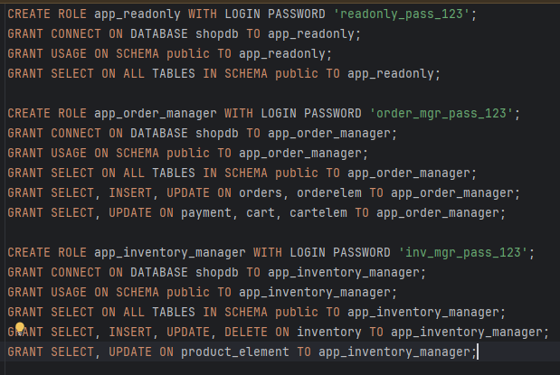
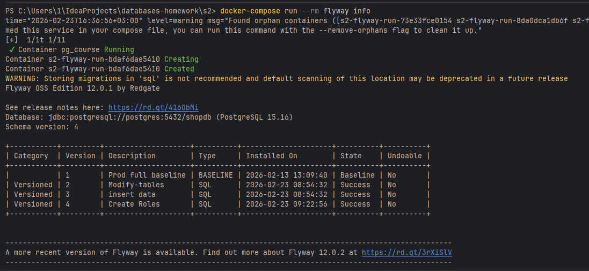
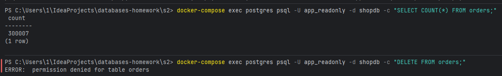

## Создание ролей и выдача прав:

* `app_readonly` - роль только для чтения
* `app_order_manager` - роль для менеджера заказов
* `app_inventory_manager` - роль для управления складами
## Миграции:

## Заливка данных
* Файл: `generate_data.py`
* Основные таблицы, куда были залиты данные: `orders`, `orderelem`, `audit_log`, `product_element`
## Пример работы с ролью:
