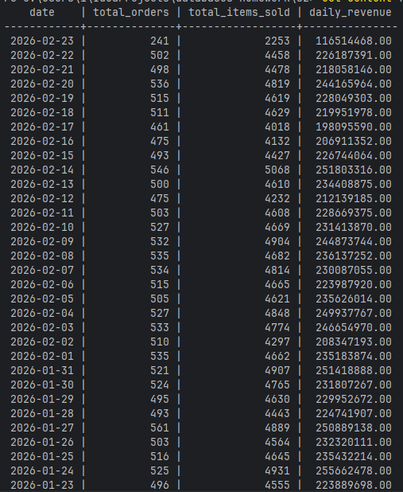
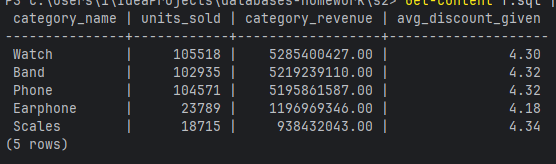
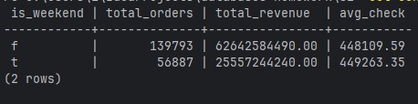
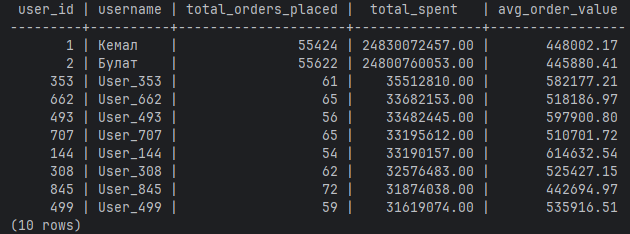

# 1. Аналитические вопросы
* Какая динамика активности и выручки по дням?
* Какие категории и товары самые популярные?
* Какова активность пользователей и их ценность?
# 2. Главный факт и его зерно
* Название таблицы: olap.fact_order_items
# 3. Зерно факта
* Зерно факта: 1 строка = одна позиция в заказе (конкретный товар в конкретном заказе).
# 4. Создание измерений
```sql
CREATE SCHEMA IF NOT EXISTS olap;

CREATE TABLE olap.dim_date (
    date_key INT PRIMARY KEY,
    date_actual DATE NOT NULL,
    day_of_month INT NOT NULL,
    month_number INT NOT NULL,
    month_name VARCHAR(20) NOT NULL,
    year_actual INT NOT NULL,
    quarter INT NOT NULL,
    day_of_week INT NOT NULL,
    is_weekend BOOLEAN NOT NULL
);

CREATE TABLE olap.dim_user (
    user_id INT PRIMARY KEY,
    username VARCHAR(150),
    email VARCHAR(150),
    registered_at TIMESTAMP,
    status VARCHAR(50)
);

CREATE TABLE olap.dim_product (
    product_element_id INT PRIMARY KEY,
    product_name VARCHAR(250),
    category_id INT,
    category_name VARCHAR(150),
    sku VARCHAR(100),
    supplier_id INT
);

CREATE TABLE olap.fact_order_items (
    fact_id SERIAL PRIMARY KEY,
    order_id INT NOT NULL,
    date_key INT NOT NULL REFERENCES olap.dim_date(date_key),
    user_id INT NOT NULL REFERENCES olap.dim_user(user_id),
    product_element_id INT NOT NULL REFERENCES olap.dim_product(product_element_id),
    quantity INT NOT NULL,
    unit_price NUMERIC(12, 2) NOT NULL,
    discount NUMERIC(12, 2) NOT NULL,
    total_revenue NUMERIC(12, 2) NOT NULL,
    order_status VARCHAR(50) NOT NULL
);
```
* olap.dim_date — календарь для удобной фильтрации по дням, неделям, месяцам. 
* olap.dim_user — профили клиентов. 
* olap.dim_product — справочник товаров с денормализованными категориями.

# 5. Заполнить OLAP-таблицы из своих OLTP-таблиц
```sql
INSERT INTO olap.dim_date (date_key, date_actual, day_of_month, month_number, month_name, year_actual, quarter, day_of_week, is_weekend)
SELECT 
    to_char(datum, 'YYYYMMDD')::INT AS date_key,
    datum AS date_actual,
    EXTRACT(DAY FROM datum) AS day_of_month,
    EXTRACT(MONTH FROM datum) AS month_number,
    to_char(datum, 'TMMonth') AS month_name,
    EXTRACT(YEAR FROM datum) AS year_actual,
    EXTRACT(QUARTER FROM datum) AS quarter,
    EXTRACT(ISODOW FROM datum) AS day_of_week,
    CASE WHEN EXTRACT(ISODOW FROM datum) IN (6, 7) THEN TRUE ELSE FALSE END AS is_weekend
FROM generate_series('2025-01-01'::DATE, '2027-12-31'::DATE, '1 day'::INTERVAL) datum;

INSERT INTO olap.dim_user (user_id, username, email, registered_at, status)
SELECT id, name, login, created_at, 'active' AS status
FROM public.users;

INSERT INTO olap.dim_product (product_element_id, product_name, category_id, category_name, supplier_id)
SELECT 
    pe.id AS product_element_id,
    p.name AS product_name,
    c.id AS category_id,
    c.name AS category_name,
    pe.supplier_id
FROM public.product_element pe
JOIN public.product p ON pe.product_id = p.id
JOIN public.category c ON p.category_id = c.id;

INSERT INTO olap.fact_order_items (order_id, date_key, user_id, product_element_id, quantity, unit_price, discount, total_revenue, order_status)
SELECT 
    o.id AS order_id,
    to_char(o.created_at, 'YYYYMMDD')::INT AS date_key,
    o.user_id,
    oe.elem_id AS product_element_id,
    oe.quantity,
    oe.unit_price,
    oe.discount,
    (oe.quantity * oe.unit_price - oe.discount) AS total_revenue,
    o.status AS order_status
FROM public.orderelem oe
JOIN public.orders o ON oe.order_id = o.id;
```

# 6. Аналитические запросы
* Динамика выручки и количества заказов по дням
```sql
SELECT
    d.date_actual AS date,
    COUNT(DISTINCT f.order_id) AS total_orders,
    SUM(f.quantity) AS total_items_sold,
    SUM(f.total_revenue) AS daily_revenue
FROM olap.fact_order_items f 
JOIN olap.dim_date d ON f.date_key = d.date_key
WHERE f.order_status NOT IN ('cancelled')
GROUP BY d.date_actual
ORDER BY d.date_actual DESC;
```



* Топ-5 самых прибыльных категорий товаров
```sql
SELECT
    p.category_name,
    SUM(f.quantity) AS units_sold,
    SUM(f.total_revenue) AS category_revenue,
    ROUND(AVG(f.discount), 2) AS avg_discount_given
FROM olap.fact_order_items f
JOIN olap.dim_product p ON f.product_element_id = p.product_element_id
WHERE f.order_status = 'delivered'
GROUP BY p.category_name
ORDER BY category_revenue DESC
LIMIT 5;
```



* Сравнение продаж в будни и выходные
```sql
SELECT
    d.is_weekend,
    COUNT(DISTINCT f.order_id) AS total_orders,
    ROUND(SUM(f.total_revenue), 2) AS total_revenue,
    ROUND(SUM(f.total_revenue) / COUNT(DISTINCT f.order_id), 2) AS avg_check
FROM olap.fact_order_items f
JOIN olap.dim_date d ON f.date_key = d.date_key
GROUP BY d.is_weekend;
```



* Топ-10 клиентов по сумме покупок и их средний чек
```sql
SELECT
    u.user_id,
    u.username,
    COUNT(DISTINCT f.order_id) AS total_orders_placed,
    SUM(f.total_revenue) AS total_spent,
    ROUND(SUM(f.total_revenue) / COUNT(DISTINCT f.order_id), 2) AS avg_order_value
FROM olap.fact_order_items f
JOIN olap.dim_user u ON f.user_id = u.user_id
WHERE f.order_status NOT IN ('cancelled')
GROUP BY u.user_id, u.username
ORDER BY total_spent DESC
LIMIT 10;
```


