## Использование ">" orders
``` sql
EXPLAIN (ANALYZE, BUFFERS) 
SELECT id, user_id, status, price 
FROM orders 
WHERE price > 100000;
```
* Без индекса
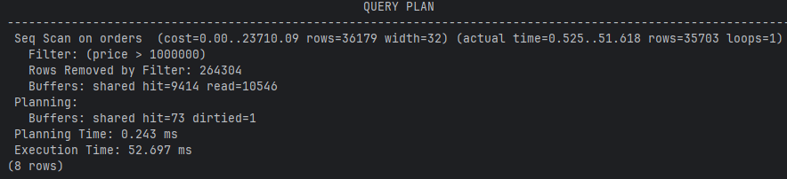
* С индексом b-tree
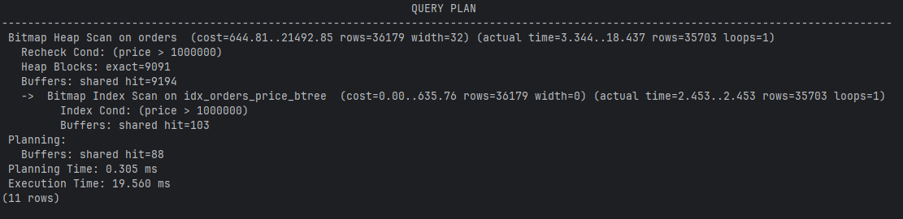
* С индексом hash
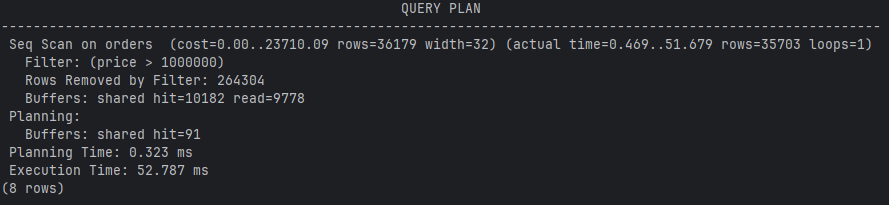

## Использование "<" product_element
``` sql
EXPLAIN (ANALYZE, BUFFERS)
SELECT id, product_id, article_num, color, price
FROM product_element
WHERE price < 5000;
```
* Без индекса
  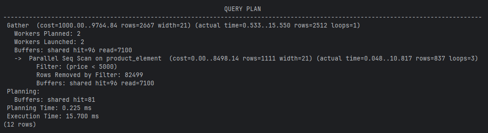
* С индексом b-tree
  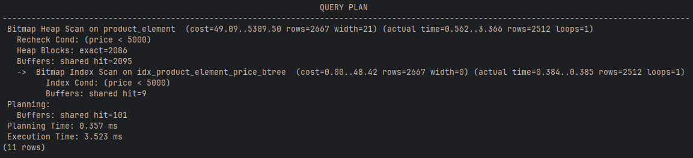
* С индексом hash
  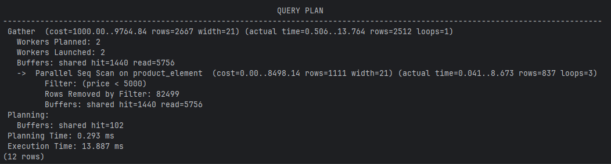

## Использование "=" orders
``` sql
EXPLAIN (ANALYZE, BUFFERS) 
SELECT id, user_id, status, created_at, price 
FROM orders 
WHERE created_at = '2025-12-02'::timestamptz;
```
* Без индекса
  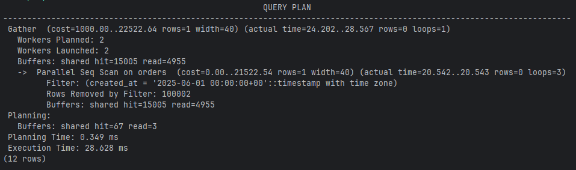
* С индексом b-tree
  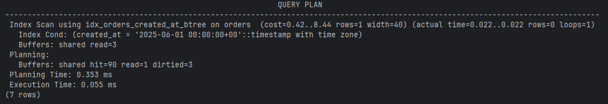
* С индексом hash
  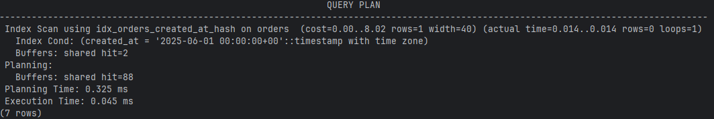

## Использование "%like" payment
``` sql
EXPLAIN (ANALYZE, BUFFERS, FORMAT TEXT) 
SELECT id, action, table_name, timestamp 
FROM audit_log 
WHERE table_name LIKE '%log';
```
* Без индекса
  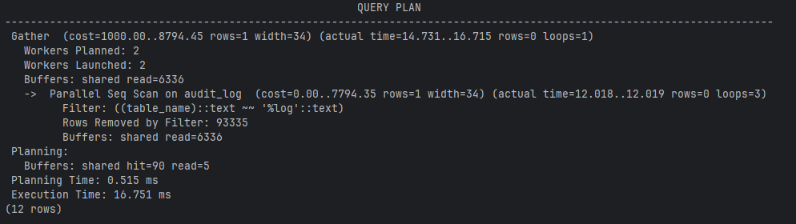
* С индексом b-tree
  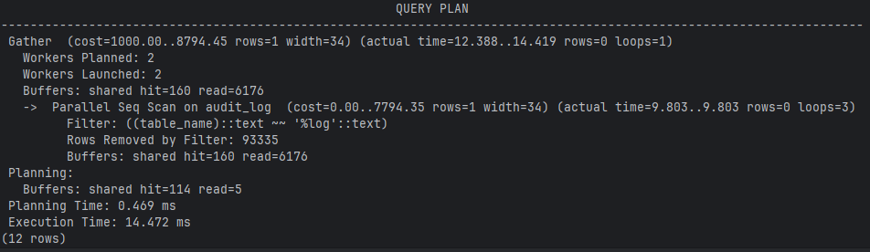
* С индексом hash
  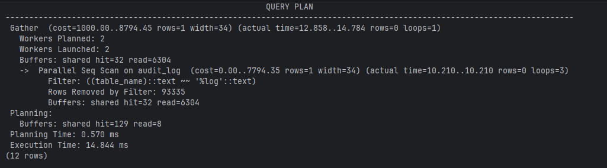

## Использование "IN" audit_log
``` sql
EXPLAIN (ANALYZE, BUFFERS) 
SELECT id, action, table_name, ip_address, timestamp 
FROM audit_log 
WHERE ip_address IN ('192.168.1.1', '192.168.1.2', '192.168.1.3', '10.0.0.1', '10.0.0.2');
```
* Без индекса
  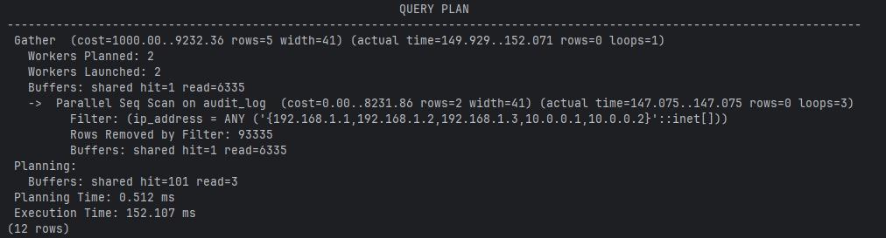
* С индексом b-tree
  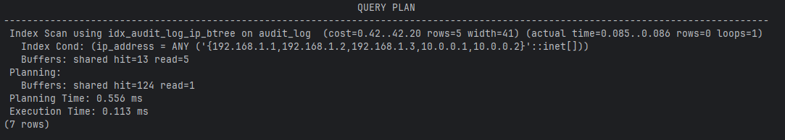
* С индексом hash
  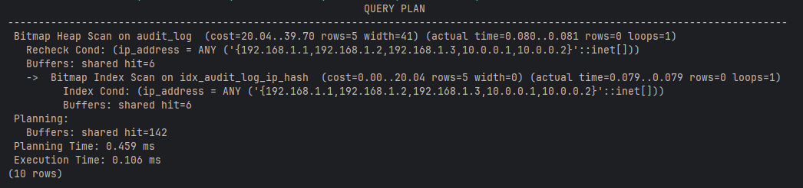

## ДОП: Составной индекс (user_id, created_at) orders
``` sql
EXPLAIN (ANALYZE, BUFFERS) 
SELECT id, user_id, status, created_at, price 
FROM orders 
WHERE user_id = 100 AND created_at >= '2025-06-01'::timestamptz;
```
* Без индекса
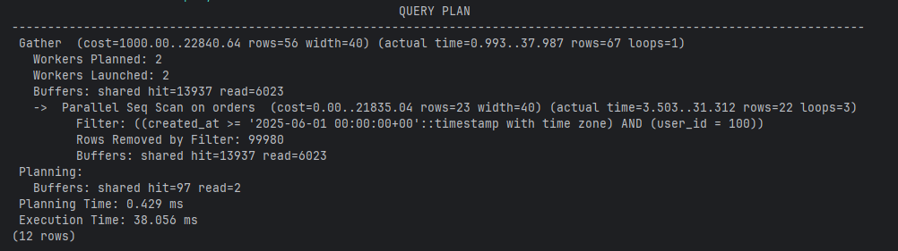
* С индексом
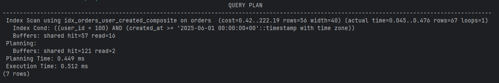
* Если только первый столбец
``` sql
WHERE user_id = 100
```
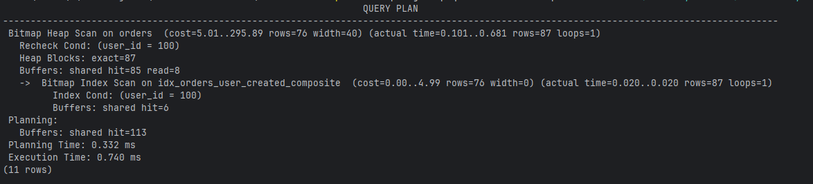
* Если только второй столбец
``` sql
WHERE created_at >= '2025-06-01'::timestamptz;
```
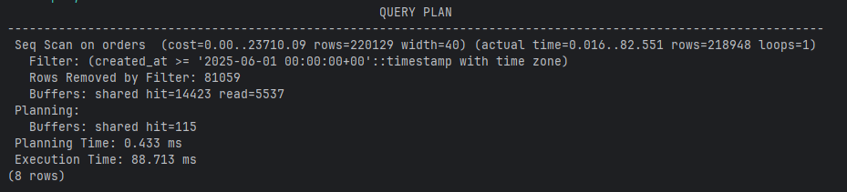