# GIN
## 1. JSONB поле `audit_log.data` - оператор @>
```sql
EXPLAIN (ANALYZE, BUFFERS)
SELECT id, action, table_name, data, timestamp
FROM audit_log
WHERE data @> '{"entity_id": 1000}';
```
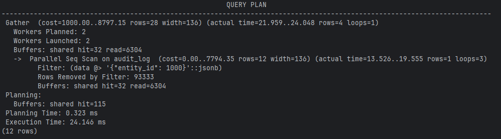
```sql
CREATE INDEX idx_audit_log_data_gin ON audit_log USING GIN (data);
```
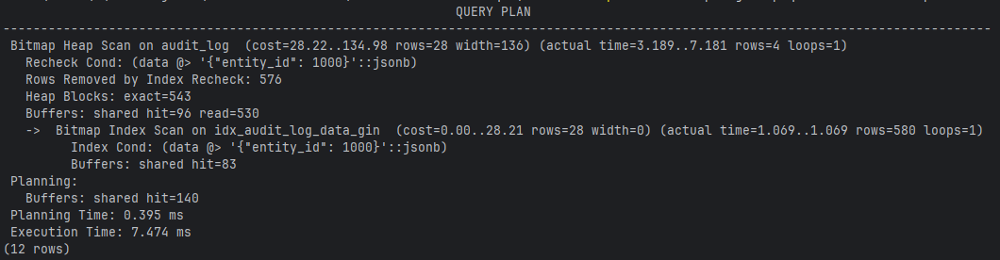
## 2. JSONB поле `audit_log.data` - оператор ?&
```sql
EXPLAIN (ANALYZE, BUFFERS)
SELECT id, action, table_name, data
FROM audit_log
WHERE data ?& ARRAY['entity_id', 'old_values', 'new_values'];
```
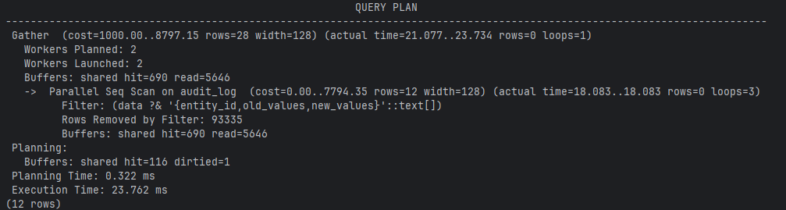
```sql
CREATE INDEX idx_audit_log_data_gin ON audit_log USING GIN (data);
```
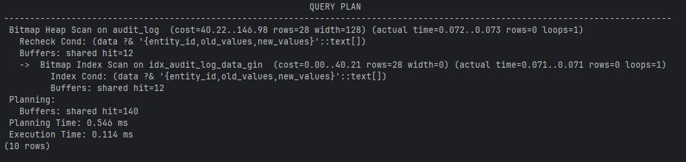
## 3. JSONB поле `product_element.attributes` - оператор ?
```sql
EXPLAIN (ANALYZE, BUFFERS)
SELECT id, product_id, attributes
FROM product_element
WHERE attributes ? 'warranty_extended';
```
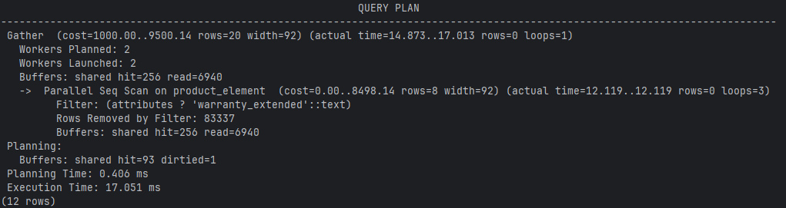
```sql
CREATE INDEX idx_product_element_attributes_gin ON product_element USING GIN (attributes);
```
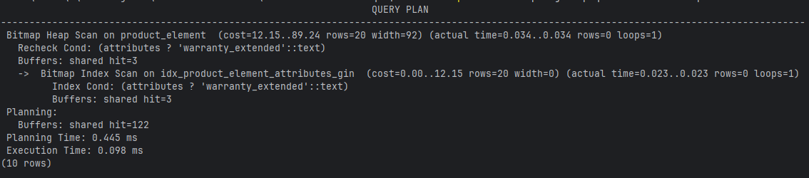
## 4. JSONB поле `product_element.attributes` - оператор ?| (в результате много строк, поэтому Seq Scan)
```sql
EXPLAIN (ANALYZE, BUFFERS)
SELECT id, product_id, attributes
FROM product_element
WHERE attributes ?| ARRAY['size', 'weight', 'tags'];
```
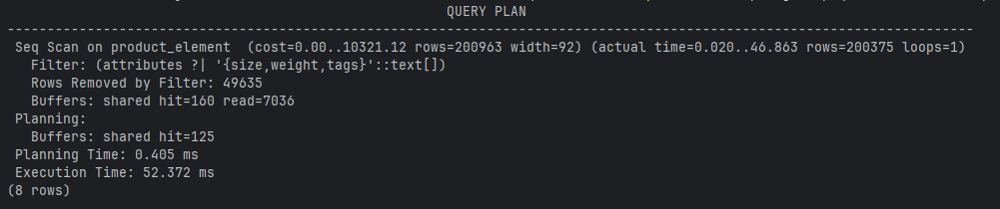
```sql
CREATE INDEX idx_product_element_attributes_gin ON product_element USING GIN (attributes);
```
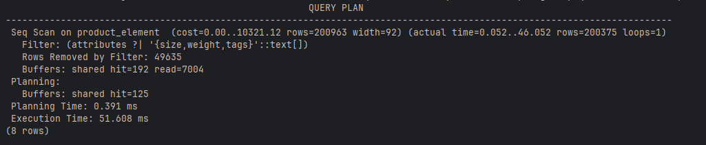
## 5. JSONB поле `audit_log.data` оператор @> вложенный поиск
```sql
EXPLAIN (ANALYZE, BUFFERS)
SELECT id, action, table_name, data
FROM audit_log
WHERE data @> '{"old_values": {"f1": 100}}';
```
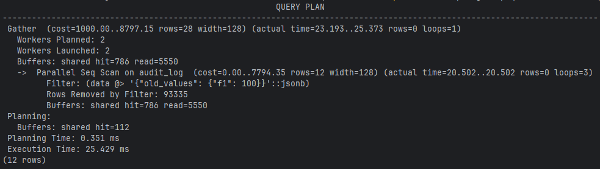
```sql
CREATE INDEX idx_audit_log_data_gin ON audit_log USING GIN (data);
```
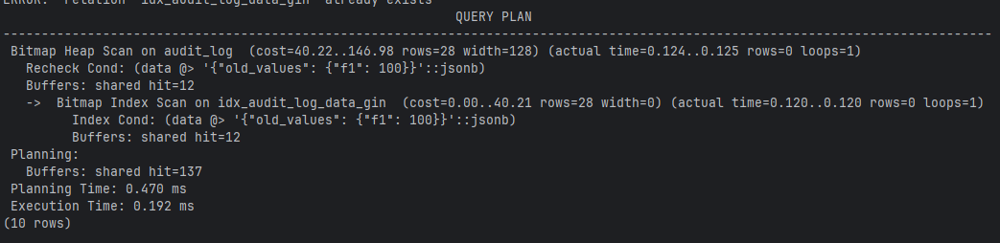

# GiST
## 1. TSTZRANGE поле `orders.delivery_window` оператор &&
```sql
EXPLAIN (ANALYZE, BUFFERS)
SELECT id, user_id, status, delivery_window, created_at
FROM orders
WHERE delivery_window && tstzrange('2025-06-01', '2025-07-01');
```
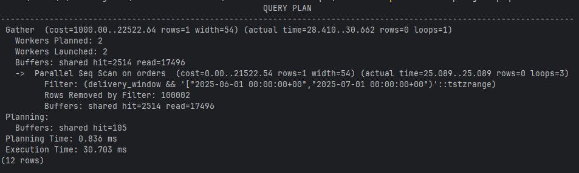
```sql
CREATE INDEX idx_orders_delivery_window_gist ON orders USING GiST (delivery_window);
```
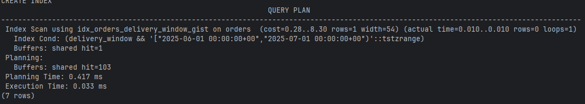
## 2. TSTZRANGE поле `orders.delivery_window` оператор @>
```sql
EXPLAIN (ANALYZE, BUFFERS)
SELECT id, user_id, delivery_window
FROM orders
WHERE delivery_window @> '2025-06-15 12:00:00'::timestamptz;
```
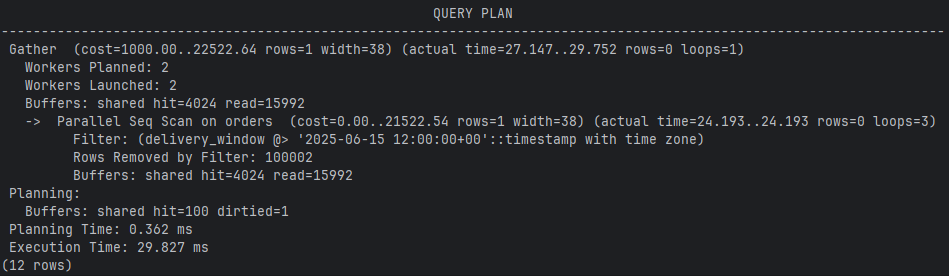
```sql
CREATE INDEX idx_orders_delivery_window_gist ON orders USING GiST (delivery_window);
```
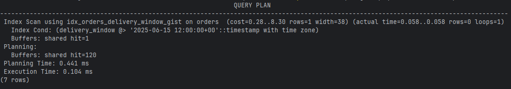
## 3. TSVECTOR поле `product.search_vector` оператор @@ to_tsquery
```sql
EXPLAIN (ANALYZE, BUFFERS)
SELECT id, name, description, search_vector
FROM product
WHERE search_vector @@ to_tsquery('russian', 'realme');
```
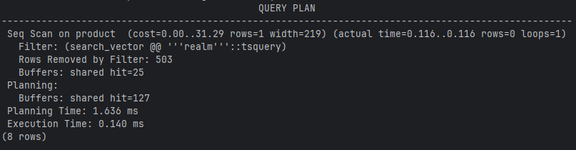
```sql
CREATE INDEX idx_product_name_gist ON product USING GiST (search_vector);
```
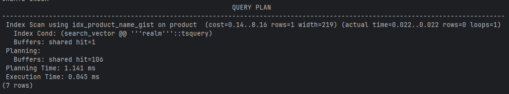
## 4. TSVECTOR поле `product.search_vector` оператор @@ to_tsquery('...&...')
```sql
EXPLAIN (ANALYZE, BUFFERS)
SELECT id, name, description
FROM product
WHERE search_vector @@ to_tsquery('russian', 'realme & pro');
```
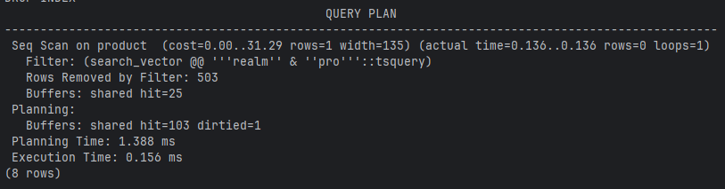
```sql
CREATE INDEX idx_product_name_gist ON product USING GiST (search_vector);
```
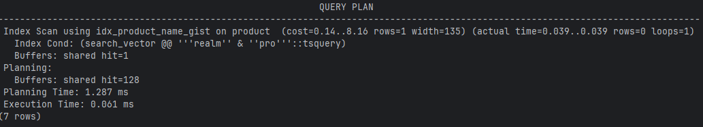
## 5. TSVECTOR поле `product.search_vector` оператор @@ to_tsquery('...| !...') (в результате много строк, поэтому Seq Scan)
```sql
EXPLAIN (ANALYZE, BUFFERS, FORMAT TEXT)
SELECT id, name, description
FROM product
WHERE search_vector @@ to_tsquery('russian', 'realme | !buds');
```
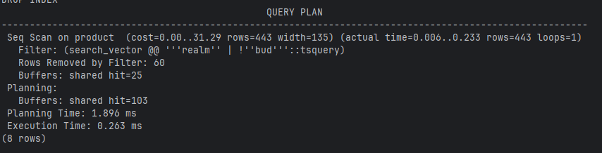
```sql
CREATE INDEX idx_product_name_gist ON product USING GiST (search_vector);
```
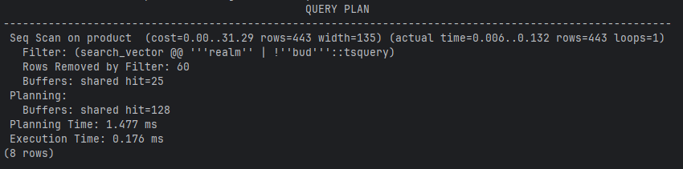

# JOIN
## 1. Hash JOIN
```sql
EXPLAIN (ANALYZE, BUFFERS)
SELECT o.id AS order_id, o.status, o.created_at, u.name AS user_name, u.login
FROM orders o
INNER JOIN users u ON o.user_id = u.id
WHERE o.user_id IS NOT NULL;
```
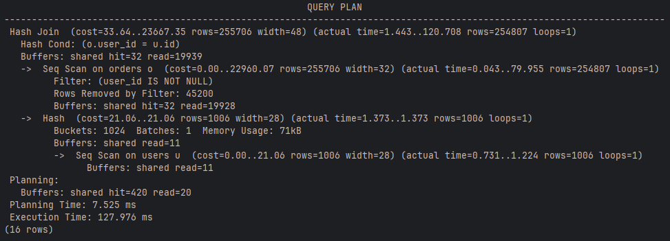
## 2. Merge JOIN
```sql
EXPLAIN (ANALYZE, BUFFERS)
SELECT o.id AS order_id, o.status, oe.elem_id, oe.quantity, oe.unit_price
FROM orders o
INNER JOIN orderelem oe ON o.id = oe.order_id
WHERE o.id > 10000;
```
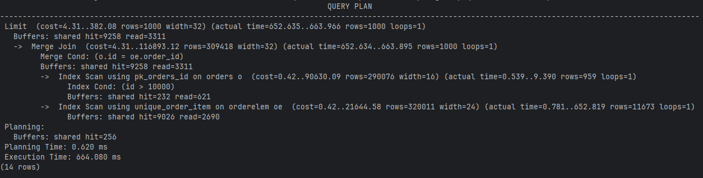
## 3. Nested Loop Memoize
```sql
EXPLAIN (ANALYZE, BUFFERS)
SELECT oe.order_id, oe.quantity, pe.article_num, pe.color, pe.price
FROM orderelem oe
INNER JOIN product_element pe ON oe.elem_id = pe.id
WHERE oe.order_id > 10000
LIMIT 1000;
```
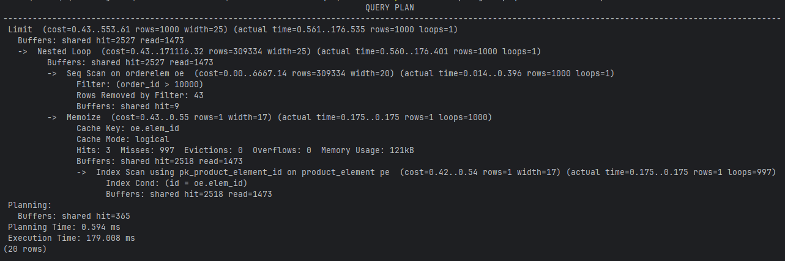
## 4. Hash JOIN
```sql
EXPLAIN (ANALYZE, BUFFERS)
SELECT pe.id AS elem_id, pe.article_num, pe.price, p.name AS product_name, p.category_id
FROM product_element pe
         INNER JOIN product p ON pe.product_id = p.id
WHERE pe.price > 10000;
```
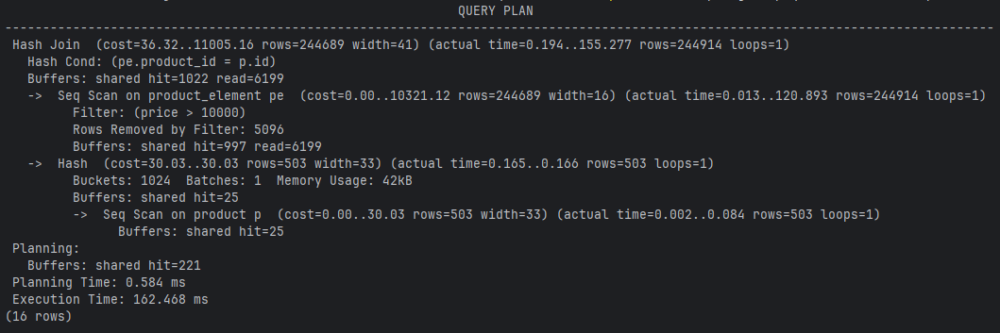
## 5. (то же, что и 4, только с LIMIT) Nested Loop Memoize
```sql
EXPLAIN (ANALYZE, BUFFERS)
SELECT pe.id AS elem_id, pe.article_num, pe.price, p.name AS product_name, p.category_id
FROM product_element pe
INNER JOIN product p ON pe.product_id = p.id
WHERE pe.price > 10000
LIMIT 1000;
```
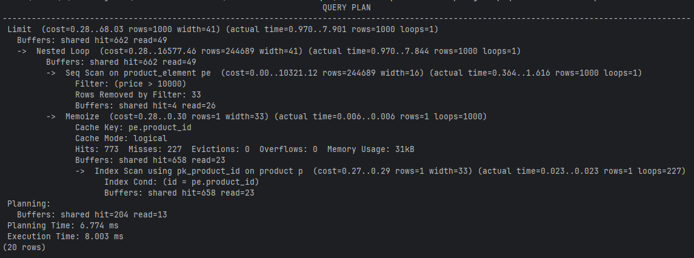