# Параметры xmin, xmax, ctid, t_infomask до и после обновления

## Два следующих `SELECT` выдают один и тот же результат:
```sql
SELECT ctid, xmin, xmax
FROM category;

SELECT t_ctid, t_xmin, t_xmax 
FROM heap_page_items(get_raw_page('category', 0));
```
## Но в 1 варианте не получить t_infomask, поэтому я далее буду ипользовать 2 вариант
## До UPDATE
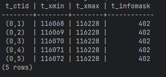
## После
```sql
UPDATE category SET name = 'Phone1' WHERE id = 1;
```
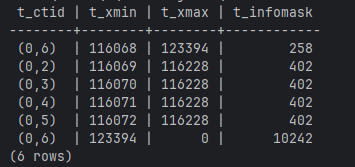

# Понять что хранится в t_infomask
```sql
SELECT
    t_infomask,
    (t_infomask & 1) AS hasnull,
    (t_infomask & 2) AS hasvarwidth,
    (t_infomask & 4) AS nattisnull,
    (t_infomask & 8) AS xmax_unlogged,
    (t_infomask & 16) AS xmax_invalid,
    (t_infomask & 32) AS xmax_lock_only,
    (t_infomask & 64) AS xmax_committed,
    (t_infomask & 128) AS xmin_invalid,
    (t_infomask & 256) AS xmin_committed,
    (t_infomask & 512) AS keys_updated,
    (t_infomask & 1024) AS moved_off,
    (t_infomask & 2048) AS moved_in
FROM heap_page_items(get_raw_page('category', 0));
```
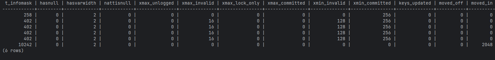
* hasnull - Есть null bitmap
* hasvarwidth - Есть переменные поля
* nattisnull - Все поля null
* xmax_unlogged - xmax не залогирован
* xmax_invalid - xmax невалиден
* xmax_lock_only - xmax только для блокировки
* xmax_committed - xmax закоммичена
* xmin_invalid - xmin невалиден
* xmin_committed - xmin закоммичен
* keys_updated - Ключи обновлены (HOT update)
* moved_off - Строка перемещена
* moved_in - Строка перемещена сюда
# Просмотр параметров для разных тарнзакций
```sql
INSERT INTO category (id, name) VALUES (10, 'Temp Category');
```
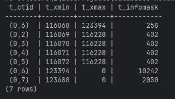
```sql
DELETE FROM category WHERE name = 'Temp Category';
```
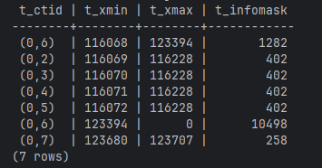
# Моделирование deadlock
```sql
-- Транзакция 1
BEGIN;
UPDATE category SET name = name || '_A' WHERE id = 1;

-- Транзакция 2
BEGIN;
UPDATE category SET name = name || '_B' WHERE id = 2;
UPDATE category SET name = name || '_B' WHERE id = 1;  -- Ждёт сессию 1

-- Транзакция 1
UPDATE category SET name = name || '_A' WHERE id = 2;
ROLLBACK;
```
Транзакция 1:
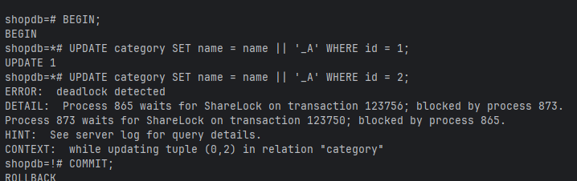
Транзакция 2:
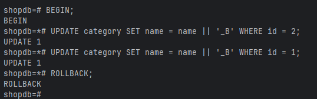

# Режимы блокировок на уровне строк
## FOR UPDATE
```sql
-- Транзакция 1:
  BEGIN;
  SELECT * FROM category WHERE id = 1 FOR UPDATE;

-- Транзакция 2:
  BEGIN;
  SELECT * FROM category WHERE id = 1 FOR UPDATE;  -- Будет ждать

-- Транзакция 1:
  COMMIT;
```
Транзакция 1:
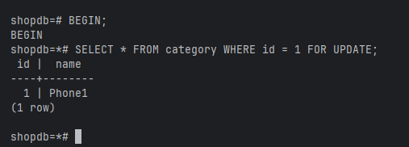
Транзакция 2 (до COMMIT у 1 транзакции):
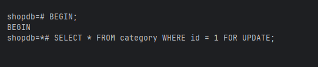
Транзакция 2 (после COMMIT у 1 транзакции):
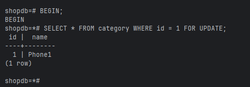
## FOR SHARE
```sql
-- Транзакция 1:
  BEGIN;
  SELECT * FROM category WHERE id = 1 FOR SHARE;

-- Транзакция 2:
  BEGIN;
  SELECT * FROM category WHERE id = 1 FOR SHARE;  -- Выполнится без ожидания
    
-- Транзакция 3:
  BEGIN;
  UPDATE category SET name = 'Phone' WHERE id = 1;  -- Будет ждать!
    
-- Транзакция 1 и 2:
  COMMIT;
```
Транзакция 1:
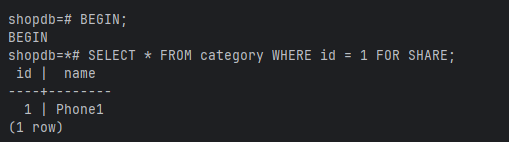
Транзакция 2:
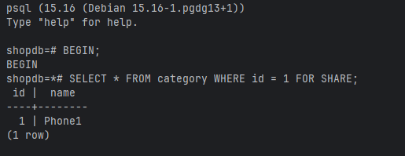
Транзакция 3 (до COMMIT у 1 и 2 транзакций):
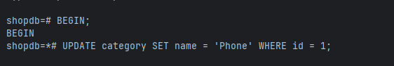
Транзакция 3 (после COMMIT у 1 и 2 транзакций):
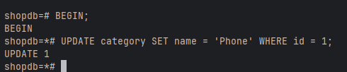
# Очистка данных
## До очистки
```sql
SELECT t_ctid, t_xmin, t_xmax, t_infomask,
    CASE
        WHEN t_xmax = 0 THEN 'ACTIVE'
        ELSE 'DEAD'
    END AS status
FROM heap_page_items(get_raw_page('category', 0))
ORDER BY t_ctid;
```
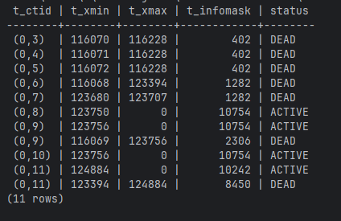
## Очистка
```sql
VACUUM category;
```
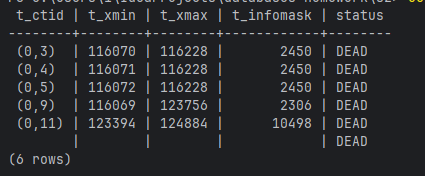
Строки удалены, но xmax не равен 0
```sql
VACUUM FULL category;
```
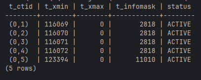