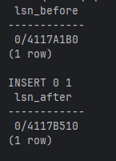
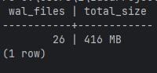
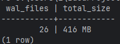
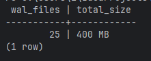
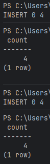

# Сравнение LSN до и после INSERT
```sql
SELECT pg_current_wal_lsn() AS lsn_before;

INSERT INTO product (id, category_id, name, characteristics)
VALUES (9000, 1, 'Test Product', '{"test": true}'::jsonb);

SELECT pg_current_wal_lsn() AS lsn_after;
```

# Сравнение WAL до и после COMMIT
```sql
SELECT
    count(*) AS wal_files,
    pg_size_pretty(sum(size)) AS total_size
FROM pg_ls_waldir();
```
* До:


```sql
INSERT INTO orders (id, user_id, status, price) VALUES (400000, 1, 'new', 1000);
```
* После:

Ничего не изменилось, так как WAL файлы занимают по 16 МБ
# Анализ WAL размера после массовой операции
```sql
INSERT INTO product_element (id, product_id, price, article_num)
SELECT
    300000 + i,
    (i % 100) + 1,
    (random() * 1000)::numeric(10,2),
    (random() * 100)::int
FROM generate_series(1, 100000) AS i
ON CONFLICT(product_id, article_num) DO NOTHING;
```


WAL уменьшился, по всей видимости Postgres его оптимизировал
# Создание дампа БД и его накат (сами дампы находятся в папке [dumps](./dumps/))
* Создание новой БД
```shell
docker-compose exec -T postgres psql -U admin -d postgres -c "CREATE DATABASE test_restore OWNER admin;"
```
* Только структура:
```shell
docker-compose exec -T postgres pg_dump -U admin -d shopdb --schema-only > dumps/structure_only.sql
Get-Content dumps/structure_only.sql | docker-compose exec -T postgres psql -U admin -d test_restore
```
* Только таблица warehouse
```shell
docker-compose exec -T postgres pg_dump -U admin -d shopdb --table=warehouse --clean --if-exists > dumps/warehouse_table.sql
Get-Content dumps/warehouse_table.sql | docker-compose exec -T postgres psql -U admin -d test_restore
```
# Создание seed
* Сами seed находятся в папке [seeds](./seeds/)
* Проверка идемпотентности
```shell
Get-Content seeds/001_seed_roles.sql | docker-compose exec -T postgres psql -U admin -d test_restore
docker-compose exec -T postgres psql -U admin -d test_restore -c "SELECT count(*) FROM role;"

Get-Content seeds/001_seed_roles.sql | docker-compose exec -T postgres psql -U admin -d test_restore
docker-compose exec -T postgres psql -U admin -d test_restore -c "SELECT count(*) FROM role;"
```

Результат в обоих случаях одинаковый, значит seed идемпотентен