# Архитектура
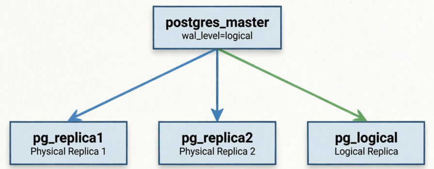
# Настройка потоковых репликаций
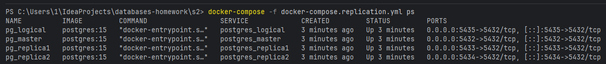
```sql
CREATE USER replicator WITH REPLICATION ENCRYPTED PASSWORD 'admin_pass';
GRANT SELECT ON ALL TABLES IN SCHEMA public TO replicator;

SELECT pg_create_physical_replication_slot('replica1_slot');
SELECT pg_create_physical_replication_slot('replica2_slot');
```
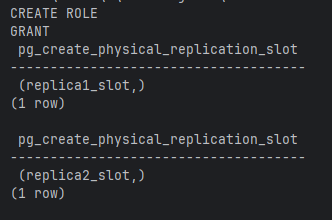

# Настройка physical streaming replication (на примере 2)

```shell
docker-compose -f docker-compose.replication.yml exec postgres_master pg_basebackup
    -h postgres_master -U replicator -D /tmp/replica2_backup -P -R

docker cp pg_master:/tmp/replica2_backup ./backups/replica2_temp

docker cp ./backups/replica2_temp/. pg_replica2:/var/lib/postgresql/data/

docker-compose -f docker-compose.replication.yml up -d postgres_replica2
```
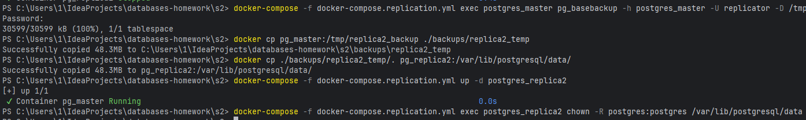

# Проверка репликации данных: вставка данных на master и на реплики
```sql
CREATE TABLE IF NOT EXISTS test_replication (
    id SERIAL PRIMARY KEY,
    name VARCHAR(100),
    created_at TIMESTAMP DEFAULT NOW()
);

INSERT INTO test_replication (name) 
VALUES ('Test Row 1'), ('Test Row 2'), ('Test Row 3');
```
```shell
docker-compose -f docker-compose.replication.yml exec postgres_replica1 psql -U admin -d shopdb -c "insert into test_replication (name) VALUES ('Should Fail');"
```
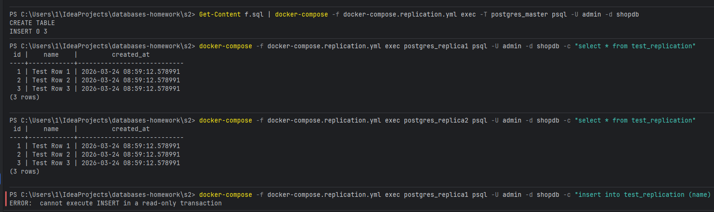

# Анализ replication lag
```sql
SELECT
    'BEFORE_LOAD' AS stage,
    client_addr,
    pg_size_pretty(pg_wal_lsn_diff(sent_lsn, replay_lsn)) AS lag,
    EXTRACT(EPOCH FROM (NOW() - reply_time))::int AS lag_seconds
FROM pg_stat_replication;

INSERT INTO test_replication (name)
SELECT 'Load ' || i || ' ' || NOW()
FROM generate_series(1, 100000) AS i;

SELECT
    'AFTER_LOAD' AS stage,
    client_addr,
    pg_size_pretty(pg_wal_lsn_diff(sent_lsn, replay_lsn)) AS lag,
    EXTRACT(EPOCH FROM (NOW() - reply_time))::int AS lag_seconds
FROM pg_stat_replication;

SELECT pg_sleep(2) AS waiting;

SELECT
    'AFTER_2SEC' AS stage,
    client_addr,
    pg_size_pretty(pg_wal_lsn_diff(sent_lsn, replay_lsn)) AS lag,
    EXTRACT(EPOCH FROM (NOW() - reply_time))::int AS lag_seconds
FROM pg_stat_replication;
```
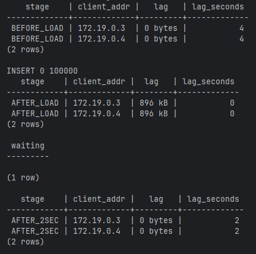

# Настройка Logical replication
```sql
-- На обоих
CREATE TABLE IF NOT EXISTS logical_test (
    id SERIAL PRIMARY KEY,
    name VARCHAR(100),
    value INTEGER,
    updated_at TIMESTAMP DEFAULT NOW()
);

-- На ведущей реплике
CREATE PUBLICATION shopdb_pub FOR TABLE logical_test;
       
-- На ведомой
CREATE SUBSCRIPTION shopdb_sub
    CONNECTION 'host=postgres_master dbname=shopdb user=admin password=admin_pass'
    PUBLICATION shopdb_pub;
```
## Данные реплицируются
```sql
-- На ведущей
INSERT INTO logical_test (name, value) 
VALUES ('Row 1', 100), ('Row 2', 200), ('Row 3', 300);

SELECT * FROM logical_test;
```
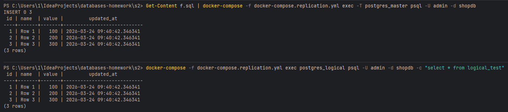
## DDL не реплицируется
```sql
-- На ведущей
ALTER TABLE logical_test ADD COLUMN test_column VARCHAR(100);
```
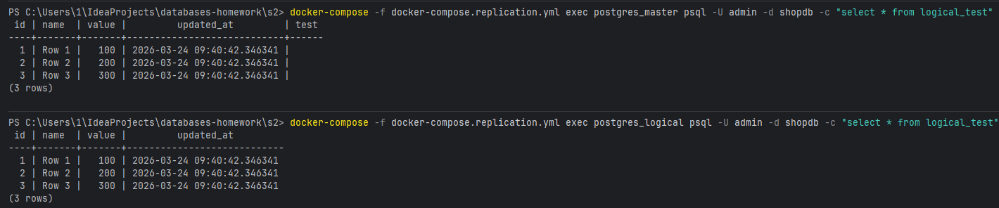
# Проверка REPLICA IDENTITY
```sql
CREATE TABLE IF NOT EXISTS no_pk_table (
    name VARCHAR(100),
    value INTEGER
);

-- На ведущей
CREATE PUBLICATION no_pk_pub FOR TABLE no_pk_table;
INSERT INTO no_pk_table (name, value) VALUES ('Test', 100);

-- На ведомой
CREATE SUBSCRIPTION no_pk_sub
    CONNECTION 'host=postgres_master dbname=shopdb user=admin password=admin_pass'
    PUBLICATION no_pk_pub;

-- На ведущей
UPDATE no_pk_table SET value = 200 WHERE name = 'Test';
SELECT * FROM no_pk_table;
```
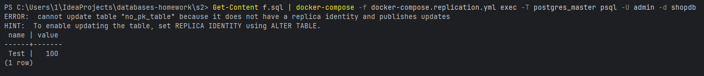
```sql
ALTER TABLE no_pk_table REPLICA IDENTITY FULL;
UPDATE no_pk_table SET value = 300 WHERE name = 'Test';
```
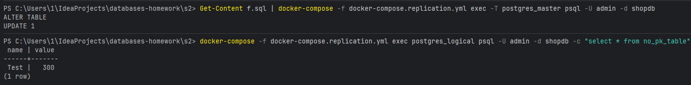
# Проверка replication status
```sql
-- На ведущей
SELECT pubname, puballtables, pubinsert, pubupdate, pubdelete
FROM pg_publication;
```
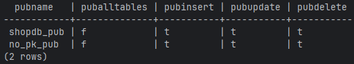
```sql
-- На ведомой
SELECT subname, subenabled, subslotname, subsynccommit
FROM pg_subscription;

SELECT srrelid::regclass AS table_name, srsubstate AS state
FROM pg_subscription_rel;
```
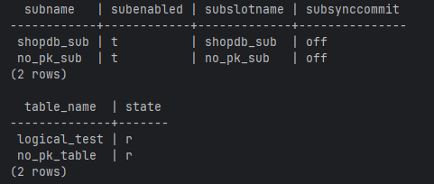

# pg_dump/pg_restore для логической репликации:
- Синхронизация схемы (DDL)
- Начальная синхронизация
- Бэкап без нагрузки на ведущую репликацию
- Миграция между версиями PostgreSQL
- Восстановление после сбоя