# Секционирование

## RANGE
```sql
CREATE TABLE orders_partitioned (
    id INTEGER,
    user_id INTEGER,
    created_at TIMESTAMP NOT NULL,
    status VARCHAR(50),
    delivery_point_id INTEGER,
    price NUMERIC,
    metadata JSONB,
    tags TEXT[],
    delivery_window TSTZRANGE,
    notes TEXT,
    search_vector TSVECTOR
) PARTITION BY RANGE (created_at);

CREATE TABLE orders_2025_q1 PARTITION OF orders_partitioned
    FOR VALUES FROM ('2025-01-01') TO ('2025-04-01');

CREATE TABLE orders_2025_q2 PARTITION OF orders_partitioned
    FOR VALUES FROM ('2025-04-01') TO ('2025-07-01');

CREATE TABLE orders_2025_q3 PARTITION OF orders_partitioned
    FOR VALUES FROM ('2025-07-01') TO ('2025-10-01');

CREATE TABLE orders_2025_q4 PARTITION OF orders_partitioned
    FOR VALUES FROM ('2025-10-01') TO ('2026-01-01');

CREATE TABLE orders_2026_q1 PARTITION OF orders_partitioned
    FOR VALUES FROM ('2026-01-01') TO ('2026-04-01');

CREATE INDEX idx_orders_created ON orders_partitioned (created_at);

INSERT INTO orders_partitioned
SELECT * FROM orders;
```

```sql
EXPLAIN (ANALYZE, BUFFERS)
SELECT count(*) FROM orders_partitioned
WHERE created_at = '2025-06-15';
```
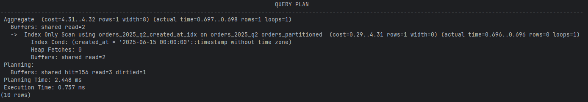

* Partition pruning - есть
* 1 партиция
* Индекс используется

```sql
EXPLAIN (ANALYZE, BUFFERS)
SELECT count(*) FROM orders_partitioned
WHERE created_at BETWEEN '2025-05-01' AND '2025-08-31';
```
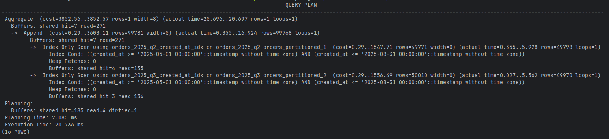

* Partition pruning - есть
* 2 партиции
* Индекс используется

```sql
EXPLAIN (ANALYZE, BUFFERS)
SELECT count(*) FROM orders_partitioned
WHERE status = 'delivered';
```
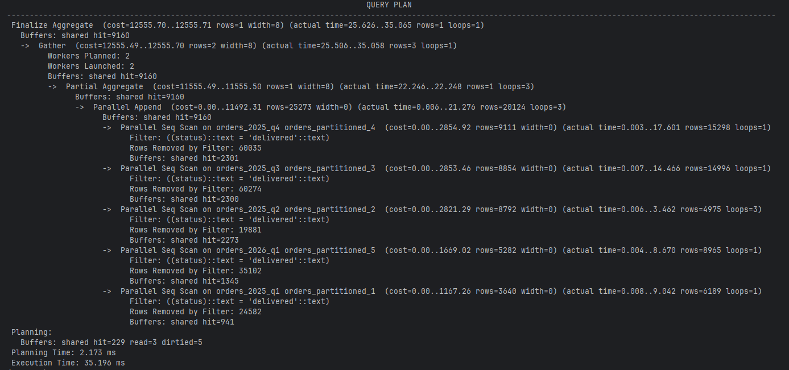

* Partition pruning - нет
* 5 партиций
* Индекс не используется

## LIST
```sql
CREATE TABLE payment_partitioned (
    id INTEGER,
    order_id INTEGER,
    status VARCHAR(50) NOT NULL,
    transaction_id TEXT,
    paid_at TIMESTAMP,
    method VARCHAR(50),
    payment_details JSONB,
    fraud_flags TEXT[],
    processing_time_ms INTEGER
) PARTITION BY LIST (status);

-- 2. Создать партиции (всего 4 значения из вашего генератора)
CREATE TABLE payment_pending PARTITION OF payment_partitioned
    FOR VALUES IN ('pending');

CREATE TABLE payment_paid PARTITION OF payment_partitioned
    FOR VALUES IN ('paid', 'failed');

CREATE TABLE payment_refunded PARTITION OF payment_partitioned
    FOR VALUES IN ('refunded');

CREATE INDEX idx_payment_status ON payment_partitioned (status);

INSERT INTO payment_partitioned
SELECT * FROM payment;
```

```sql
EXPLAIN (ANALYZE, BUFFERS)
SELECT count(*) FROM payment_partitioned
WHERE status = 'paid';
```
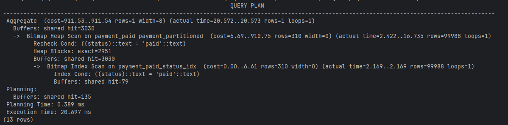

* Partition pruning - есть
* 1 партиция
* Индекс используется

```sql
EXPLAIN (ANALYZE, BUFFERS)
SELECT count(*) FROM payment_partitioned
WHERE status IN ('pending', 'paid');
```
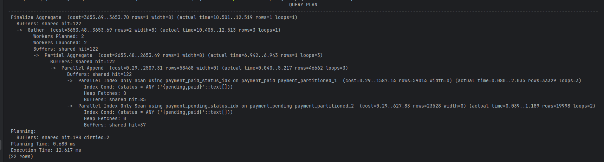

* Partition pruning - есть
* 2 партиции
* Индекс используется

```sql
EXPLAIN (ANALYZE, BUFFERS)
SELECT count(*) FROM payment_partitioned
WHERE method = 'card';
```
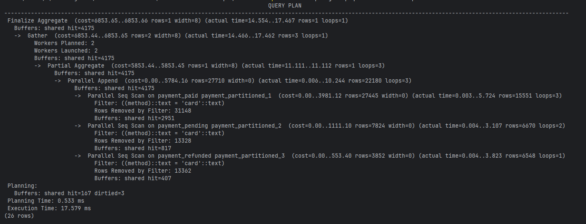

* Partition pruning - нет
* 3 партиции
* Индекс не используется
## HASH
```sql
CREATE TABLE audit_log_partitioned (
    id INTEGER,
    action VARCHAR(50),
    table_name VARCHAR(100),
    data JSONB,
    timestamp TIMESTAMP,
    user_id INTEGER,
    ip_address INET
) PARTITION BY HASH (id);

CREATE TABLE audit_log_hash_p0 PARTITION OF audit_log_partitioned
    FOR VALUES WITH (MODULUS 4, REMAINDER 0);

CREATE TABLE audit_log_hash_p1 PARTITION OF audit_log_partitioned
    FOR VALUES WITH (MODULUS 4, REMAINDER 1);

CREATE TABLE audit_log_hash_p2 PARTITION OF audit_log_partitioned
    FOR VALUES WITH (MODULUS 4, REMAINDER 2);

CREATE TABLE audit_log_hash_p3 PARTITION OF audit_log_partitioned
    FOR VALUES WITH (MODULUS 4, REMAINDER 3);

CREATE INDEX idx_audit_id ON audit_log_partitioned (id);

INSERT INTO audit_log_partitioned
SELECT * FROM audit_log;
```

```sql
EXPLAIN (ANALYZE, BUFFERS)
SELECT * FROM audit_log_partitioned WHERE id = 10000;
```
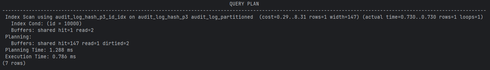

* Partition pruning - есть
* 1 партиция
* Индекс используется

```sql
EXPLAIN (ANALYZE, BUFFERS)
SELECT count(*) FROM audit_log_partitioned 
WHERE id BETWEEN 10000 AND 10001;
```
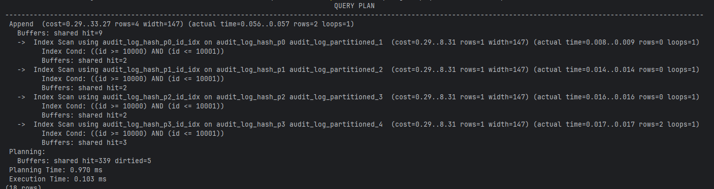

* Partition pruning - нет
* 4 партиции
* Индекс используется

```sql
EXPLAIN (ANALYZE, BUFFERS, FORMAT TEXT)
SELECT * FROM audit_log_partitioned
WHERE id = 10000 OR id = 10001;
```
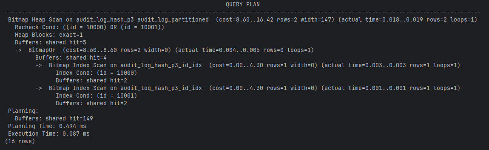

* Partition pruning - есть
* 2 партиции
* Индекс используется

# Секционирование и физическая репликация
* На мастере созданы те же таблицы, что и в 1 части ДЗ
## Проверка, что секционирование есть на репликах
* Проверка что партиционированные таблицы существуют
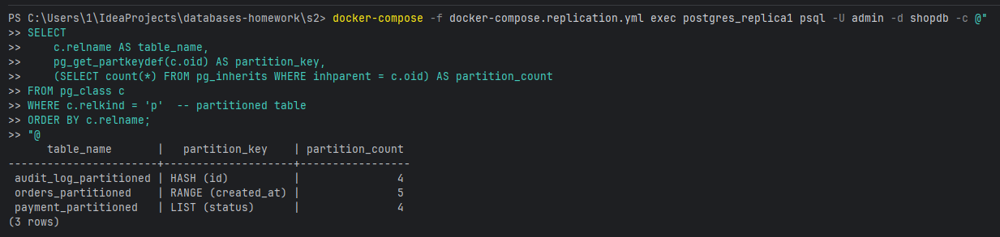
* Проверка что партиции созданы
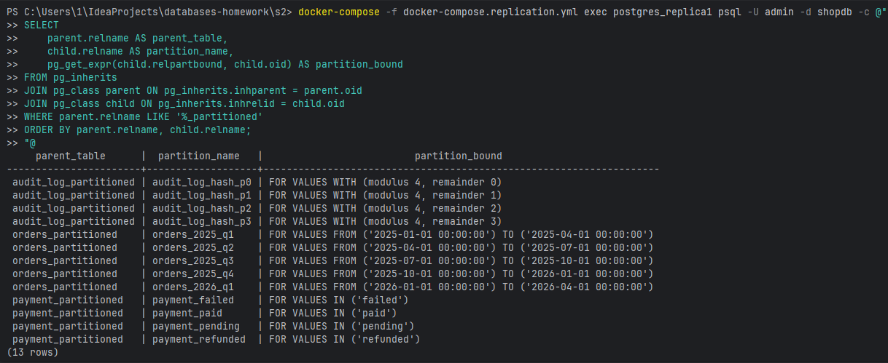
* Проверка что индексы созданы на партициях
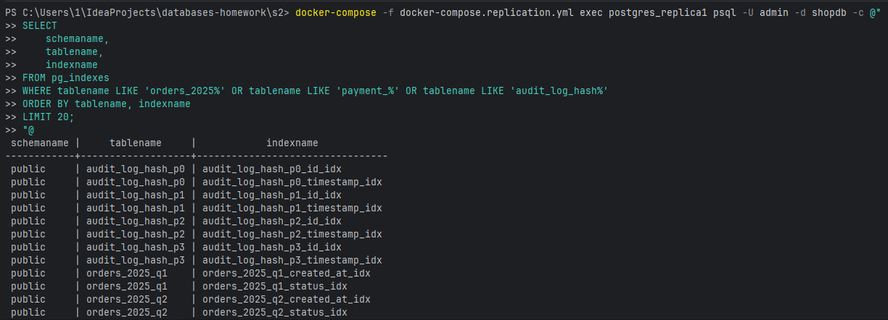

# Логическая репликация и секционирование
## publish_via_partition_root = off (по умолчанию)
* Настройка логической репликации
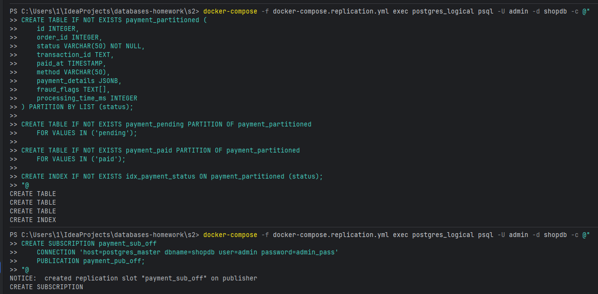
* Вставка данных, на которые подписаны и не подписаны
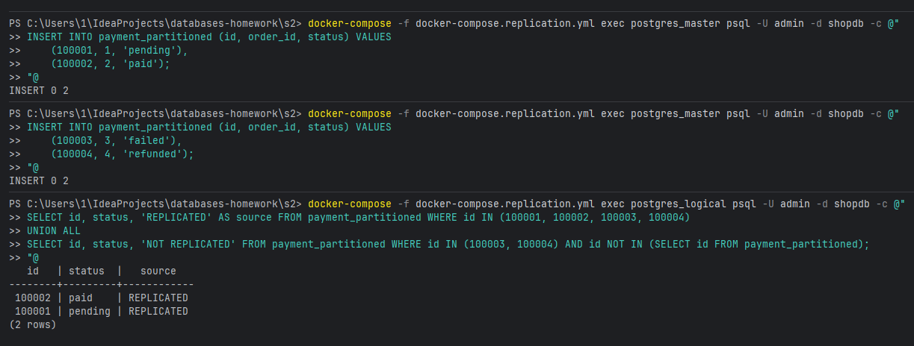
* Добавление новой партиции
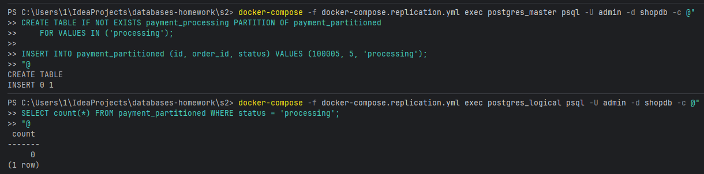
## publish_via_partition_root = on
* Настройка логической репликации
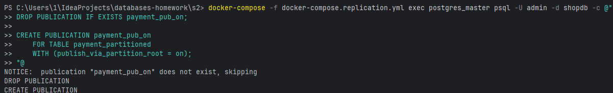
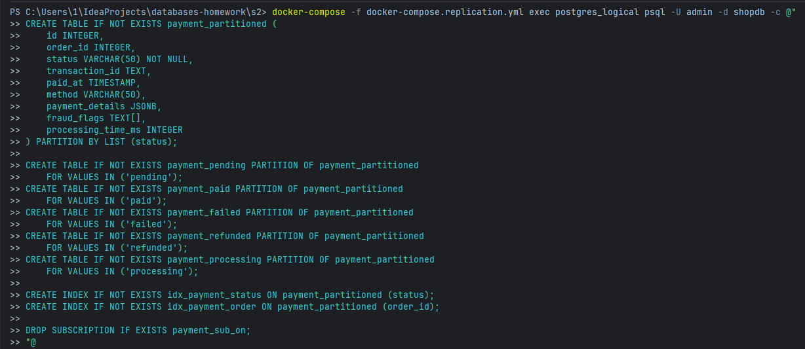
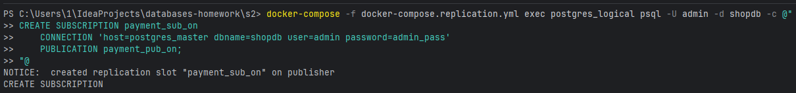
* Вставка данных и проверка
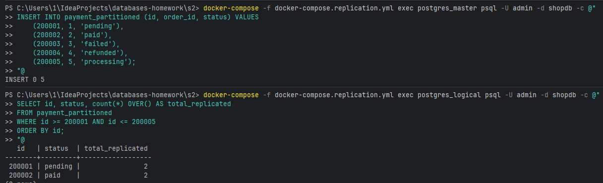
* Добавление новой партиции
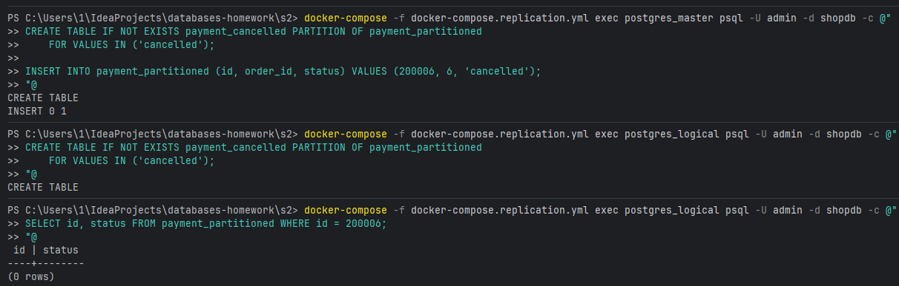

# Шардирование через postgres_fdw
## Создание 2 шардов и 1 router (FDW)
* Создание локальной таблицы на обоих шардах
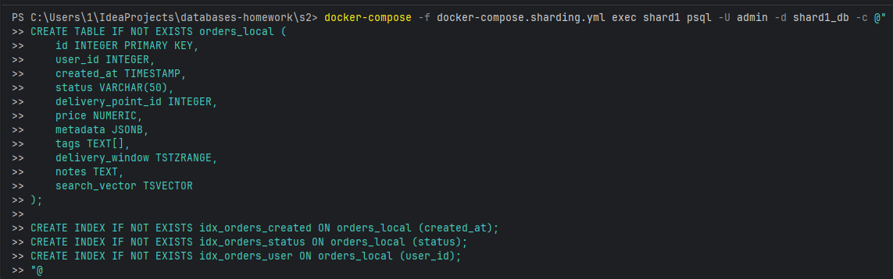
* Копирование данных с нечетным id в 1 шард и с четным - во 2
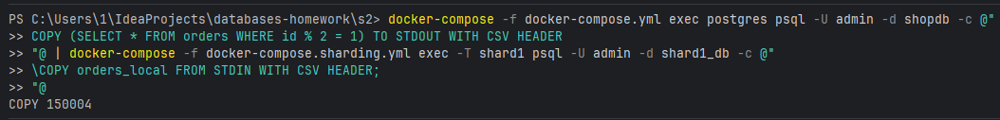
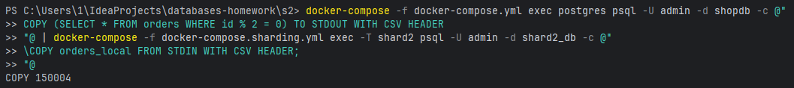
* Создание серверов для шардов на router
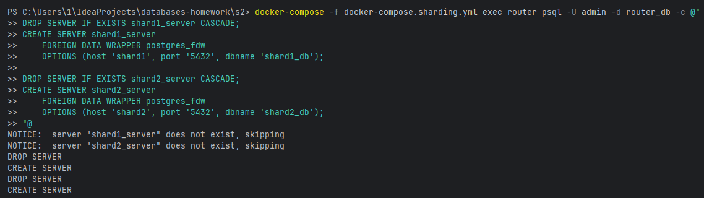
* Создание user mapping
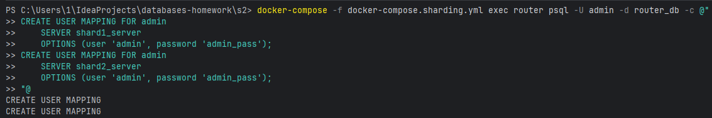
* Создание Foreign table
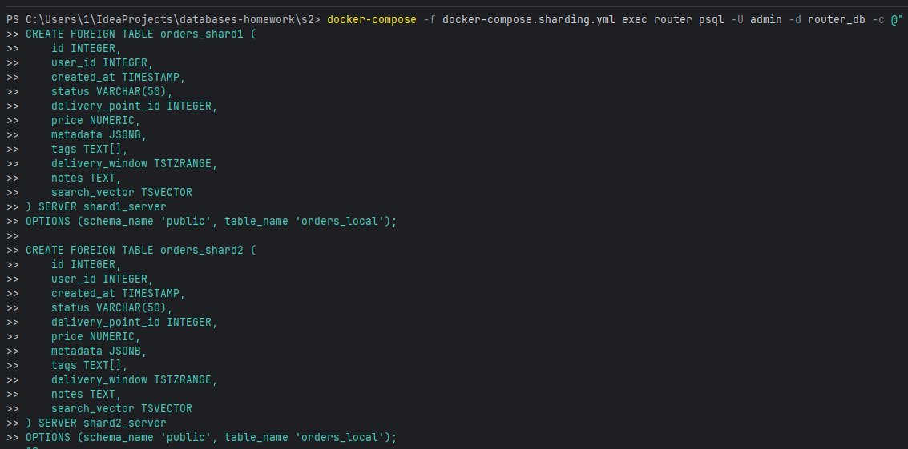
* Создать view-router (объединяет шарды)
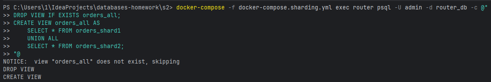
## Запросы и план запросов
* Простой запрос на все данные
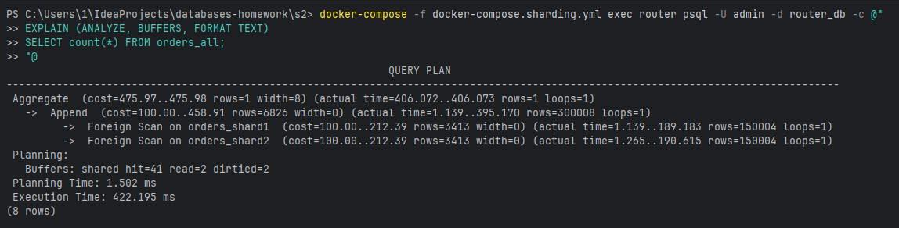
* Простой запрос на шард
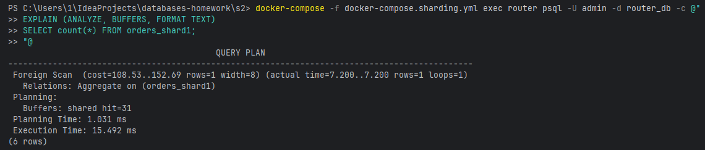