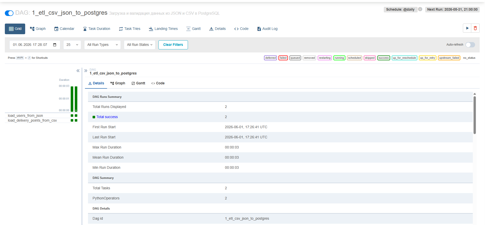
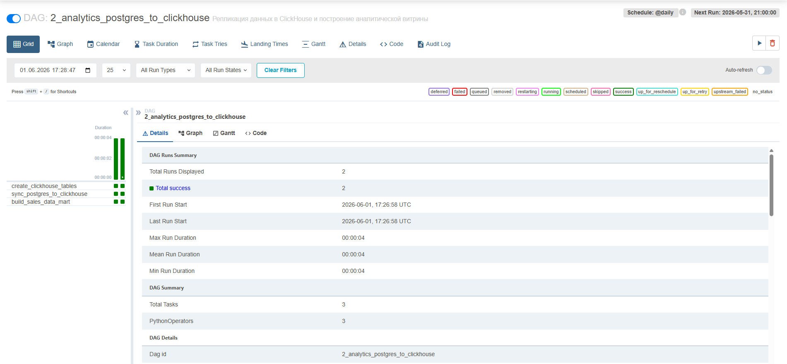
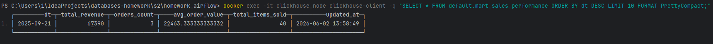
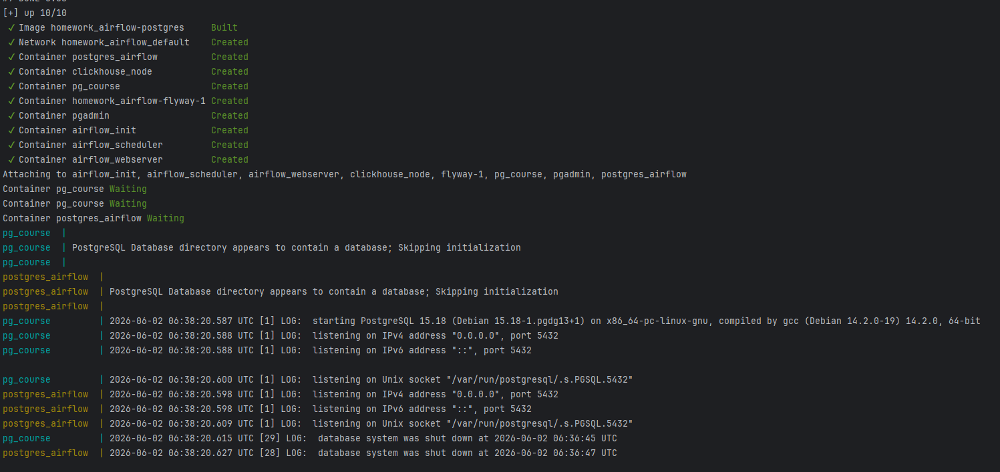
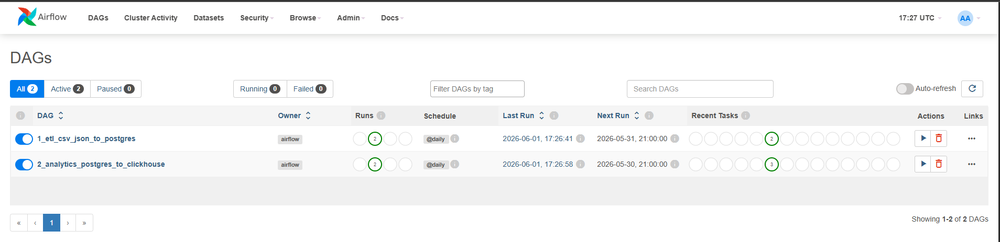

# 1. Источники данных
* `new_users.json` - новые пользователи, которых необходимо добавить в БД
* `new_delivery_points.csv` - новые пункты выдачи заказов, которые необходимо добавить в БД
# 2. Пополняемые таблицы проекта
* `public.users`
* `public.delivery_point`
# 3. Как устроен DAG 1
Данный DAG под названием `1_etl_csv_json_to_postgres` представляет собой классический первичный ETL-пайплайн. 
Его главная цель — забирать сырые данные из файлов локального хранилища, проводить их базовую валидацию и загружать в реляционную базу данных PostgreSQL.

Задачи в DAG 1:
* `load_users_from_json` - загрузка пользователей из JSON
* `load_delivery_points_from_csv` - загрузка пунктов выдачи из CSV



# 4. Как устроен DAG 2
DAG 2 (`2_analytics_postgres_to_clickhouse`) спроектирован как аналитический ELT-пайплайн, автоматизирующий сбор транзакционных данных и построение отчетности. Он настроен на ежедневный запуск (`@daily`)

Задачи в DAG 2:
* `create_clickhouse_tables` (Инициализация): Проверяет наличие необходимых таблиц в ClickHouse и, если их нет, создает структуру для сырых данных (`ch_orders`, `ch_order_elements`) и итоговую витрину (`mart_sales_performance`).
* `sync_postgres_to_clickhouse` (Экстракция и Загрузка): Подключается к операционной базе, забирает свежие данные по заказам и их элементам, денормализует их, очищает от таймзон и пустых значений, после чего отправляет в ClickHouse.
* `build_sales_data_mart` (Трансформация / Расчет): Сначала полностью очищает старое состояние витрины командой `TRUNCATE`, а затем одним эффективным SQL-запросом агрегирует сырые данные по дням напрямую внутри ClickHouse.


# 5. Таблица в Clickhouse
Зеркало операционной таблицы заказов из PostgreSQL:
```sql
CREATE TABLE IF NOT EXISTS default.ch_orders (
    id Int64,
    user_id Nullable(Int64),
    created_at DateTime,
    status String,
    price Nullable(Int64)
) ENGINE = ReplacingMergeTree()
ORDER BY id;
```
Денормализованная таблица, хранит кто, когда, по какой цене и в каком количестве купил каждый конкретный товар:
```sql
CREATE TABLE IF NOT EXISTS default.ch_order_elements (
    id Int64,
    order_id Int64,
    product_name String,
    color String,
    quantity Int32,
    unit_price Int32,
    discount Int32,
    created_at DateTime
) ENGINE = ReplacingMergeTree()
ORDER BY (order_id, id);
```
Аналитическая витрина продаж, хранит исключительно сжатые, предварительно рассчитанные и агрегированные показатели в разрезе дней:
```sql
CREATE TABLE IF NOT EXISTS default.mart_sales_performance (
    dt Date,
    total_revenue Float64,
    orders_count UInt64,
    avg_order_value Float64,
    total_items_sold UInt64,
    updated_at DateTime
) ENGINE = MergeTree()
ORDER BY dt;
```
# 6. Какая аналитическая витрина построена.
В базе данных ClickHouse сформирована таблица default.mart_sales_performance.
* Это ежедневная витрина коммерческих показателей, построенная на базе движка MergeTree() с ключом сортировки `ORDER BY dt`. 
* Зерно таблицы — один календарный день (dt), то есть каждая строка хранит агрегированные результаты продаж компании за конкретные сутки.

# 7. Какие метрики считаются.
* `dt` — дата совершения продаж (расчетный день). 
* `total_revenue` — общая выручка (совокупная стоимость проданных позиций: `sum(quantity * unit_price)`). 
* `orders_count` — количество уникальных заказов за сутки (`uniq(order_id)`). 
* `avg_order_value` — средний чек одного заказа (отношение выручки к числу уникальных заказов, защищено от деления на ноль условным оператором `if`). 
* `total_items_sold` — общее количество проданных штук товара (`sum(quantity)`). 
* `updated_at` — дата и время фиксации или пересчета строки данных (`now()`).



# 8. Как обеспечена идемпотентность
## JSON в задаче `load_users_from_json`
В таблице `public.users` стоит `UNIQUE` на поле `login`. В коде вставки написано `ON CONFLICT (login) DO NOTHING`
## CSV в задаче `load_delivery_points_from_csv`
В таблице `public.delivery_point` стоит `UNIQUE` на поля `(method, address)`. В коде вставки написано `ON CONFLICT (method, address) DO NOTHING`

# 9. Какие проверки качества данных реализованы

## JSON в задаче `load_users_from_json`

* JSON файл существует и не пустой. Если нет, то в лог пишется `Пропуск задачи`. DAG не падает с ошибкой
* Если файл присутствует, но поврежден (некорректный синтаксис JSON), код явно генерирует исключение `AirflowFailException`
* В JSON объекте присутствуют непустые поля `name`, `login`, `password`
* Если в JSON объекте нет поля `role_id`, он становится равным `2`

## CSV в задаче `load_delivery_points_from_csv`

* CSV файл существует и не пустой. Если нет, то в лог пишется `Пропуск задачи`. DAG не падает с ошибкой
* Если файл присутствует, но поврежден (сломанная структура CSV), код явно генерирует исключение `AirflowFailException`
* К загруженной таблице применяется фильтр `.dropna(subset=['method', 'address'])`. Это принудительно удаляет из набора данных любые строки, где пропущен тип доставки или адрес пункта выдачи.

# 10. Запуск проекта
Находясь в папке homework_airflow выполнить в терминале:
```shell
docker-compose up --build
```



Далее перейти на `localhost:8080`, ввести учетные данные:
* `username`: admin
* `password`: admin


