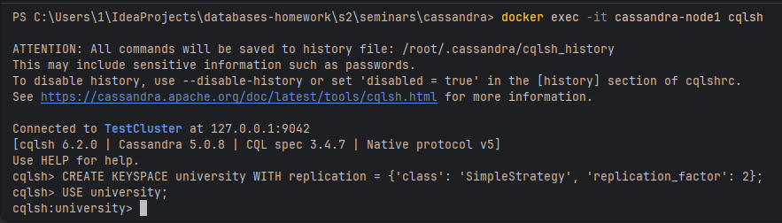
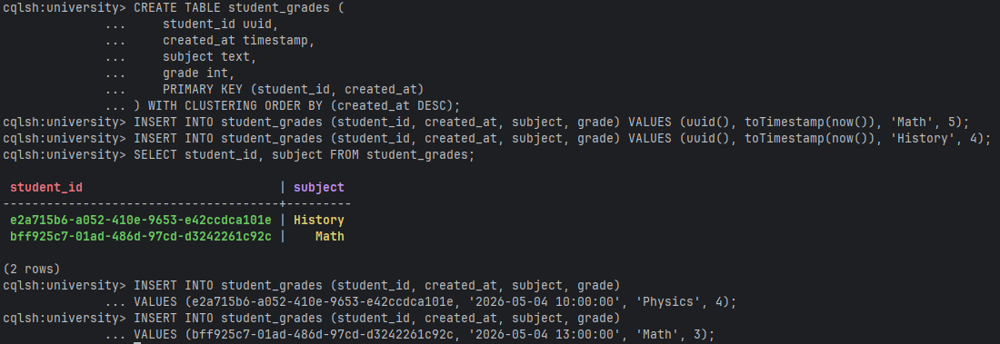
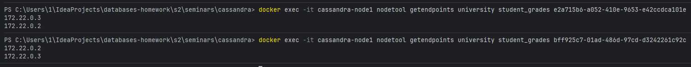
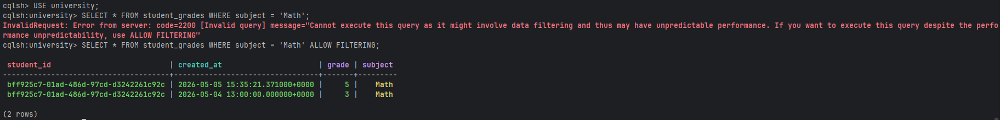

# Задание 1. Инициализация БД с репликацией
```
CREATE KEYSPACE university WITH replication = {'class': 'SimpleStrategy', 'replication_factor': 2};
USE university;
```


# Задание 2. Создание таблицы и данных
```
CREATE TABLE student_grades (
    student_id uuid,
    created_at timestamp,
    subject text,
    grade int,
    PRIMARY KEY (student_id, created_at)
) WITH CLUSTERING ORDER BY (created_at DESC);

INSERT INTO student_grades (student_id, created_at, subject, grade) VALUES (uuid(), toTimestamp(now()), 'Math', 5);
INSERT INTO student_grades (student_id, created_at, subject, grade) VALUES (uuid(), toTimestamp(now()), 'History', 4);

SELECT student_id, subject FROM student_grades;

# Чтобы использовать те же самые UUID, которые были сгенерированы
INSERT INTO student_grades (student_id, created_at, subject, grade) 
VALUES (e2a715b6-a052-410e-9653-e42ccdca101e, '2026-05-04 10:00:00', 'Physics', 4);

INSERT INTO student_grades (student_id, created_at, subject, grade) 
VALUES (bff925c7-01ad-486d-97cd-d3242261c92c, '2026-05-04 13:00:00', 'Math', 3);
```



# Задание 3. Проверка распределения данных (Partitioning)



# Задание 4. Работа с фильтрацией
```
USE university;
SELECT * FROM student_grades WHERE subject = 'Math';
SELECT * FROM student_grades WHERE subject = 'Math' ALLOW FILTERING;
```

