# Задание 1.
### Найдите топ-10 IP-адресов по количеству запросов.
```sql
SELECT ip, count() AS total_requests
FROM web_logs
GROUP BY ip
ORDER BY total_requests DESC
LIMIT 10;
```

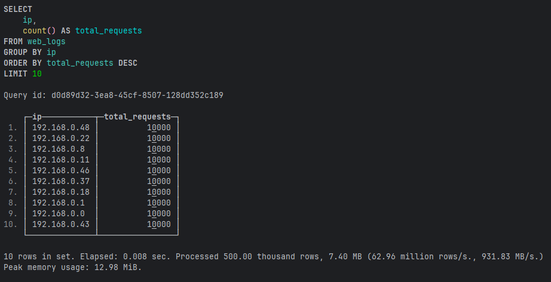

### Посчитайте процент успешных запросов (2xx) и ошибочных (4xx, 5xx).
```sql
SELECT 
    round(countIf(status_code >= 200 AND status_code < 300) * 100 / count(), 2) AS success_pct,
    round(countIf(status_code >= 400 AND status_code < 600) * 100 / count(), 2) AS error_pct
FROM web_logs;
```

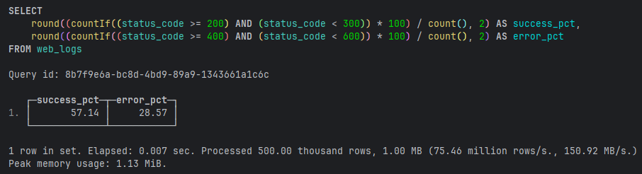
### Найдите самый популярный URL и средний размер ответа для него.
```sql
SELECT url, count() AS visits, avg(response_size) AS avg_size
FROM web_logs
GROUP BY url
ORDER BY visits DESC
LIMIT 1;
```

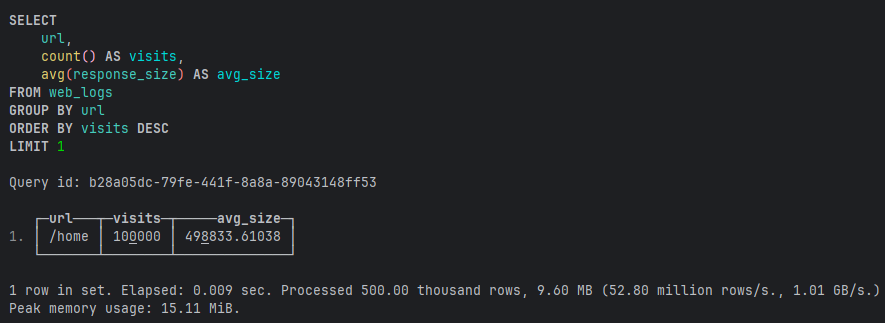
### Определите час с наибольшим количеством ошибок 500.
```sql
SELECT toHour(log_time) AS hour, count() AS errors_500
FROM web_logs
WHERE status_code = 500
GROUP BY hour
ORDER BY errors_500 DESC
LIMIT 1;
```

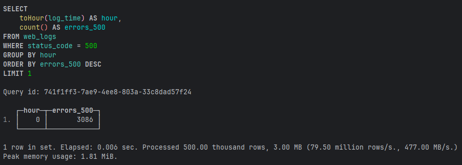

# Задание 2.
### Выполните замеры и сделайте выводы
* ClickHouse - 0.2 сек
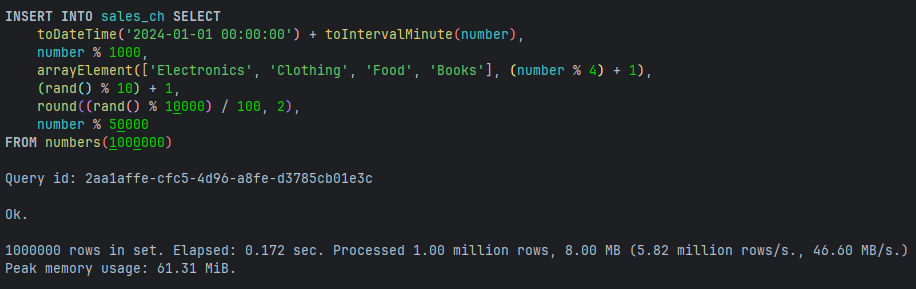
* PostgreSQL - 4.6 сек
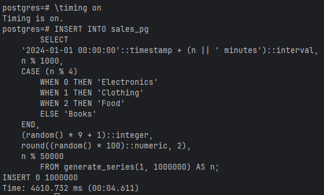

### Продажи за последний месяц
* ClickHouse
```sql
SELECT sum(quantity * price) 
FROM sales_ch 
WHERE sale_date >= now() - INTERVAL 1 MONTH;
```
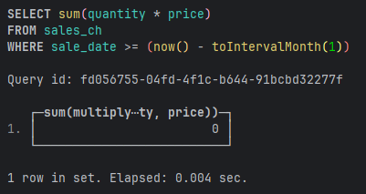
* PostgreSQL
```sql
SELECT sum(quantity * price) 
FROM sales_pg 
WHERE sale_date >= NOW() - INTERVAL '1 month';
```
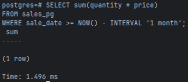
### Размер данных
* ClickHouse
```sql
SELECT table,
    formatReadableSize(total_bytes) AS size,
    total_rows
FROM system.tables
WHERE name = 'sales_ch';
```
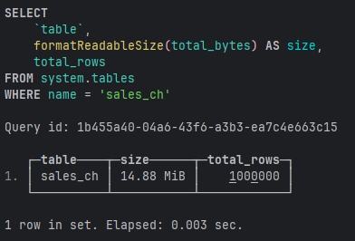
* PostgreSQL
```sql
SELECT pg_size_pretty(pg_total_relation_size('sales_pg'));
```
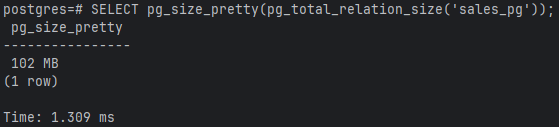

## Ответьте на вопросы:

1. Какая СУБД быстрее вставила 1 млн строк? - ClickHouse
2. Во сколько раз ClickHouse сжал данные эффективнее? - в 6,8 раз
3. Какой вывод можно сделать о выборе СУБД для аналитики? - лучше для большой, тяжелой аналитики
4. Разница ClickHouse и PostgreSQL. 
ClickHouse - колоночная, быстрые INSERT, быстрая агрегация
PostgreSQL - строковая, быстрые UPDATE / DELETE, транзакции (ACID), сложные связи (JOIN)

# Задание 3.
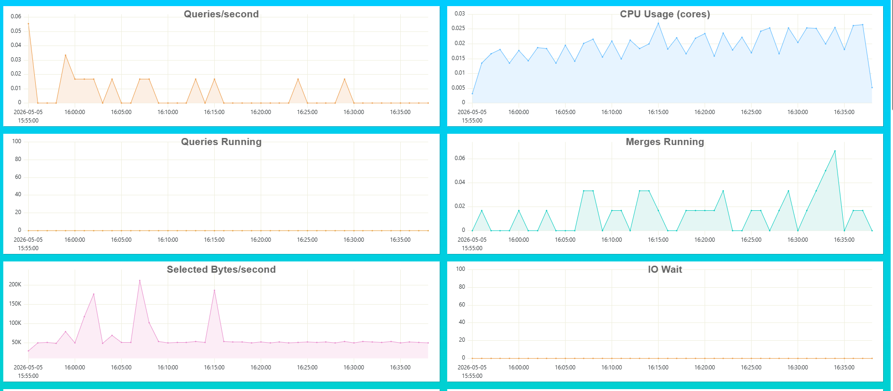