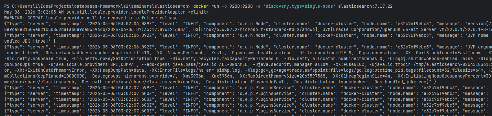
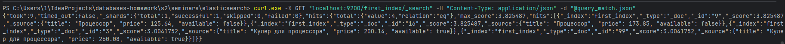
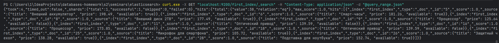
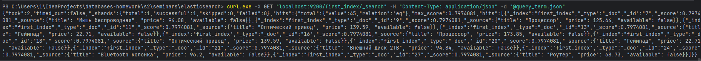
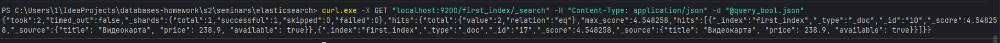

# 1. Поднять Elastic

# 2. Создать индекс
```shell
curl.exe -X PUT "localhost:9200/first_index" -H "Content-Type: application/json" -d "@mapping.json"
```
# 3. Заполнить данными
```shell
curl.exe -X POST "localhost:9200/first_index/_bulk" -H "Content-Type: application/x-ndjson" --data-binary "@data.json"
```
# 4. Написать 4 запроса (поиск по названию, фильтры, `match`, `range`, `term`, `bool`)
```shell
curl.exe -X GET "localhost:9200/first_index/_search" -H "Content-Type: application/json" -d "@query_match.json"
```



```shell
curl.exe -X GET "localhost:9200/first_index/_search" -H "Content-Type: application/json" -d "@query_range.json"
```



```shell
curl.exe -X GET "localhost:9200/first_index/_search" -H "Content-Type: application/json" -d "@query_term.json"
```



```shell
curl.exe -X GET "localhost:9200/first_index/_search" -H "Content-Type: application/json" -d "@query_bool.json"
```


