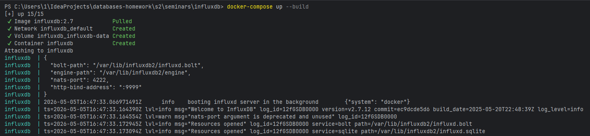
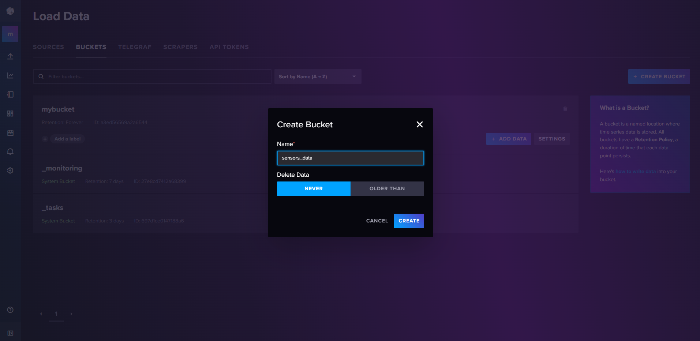
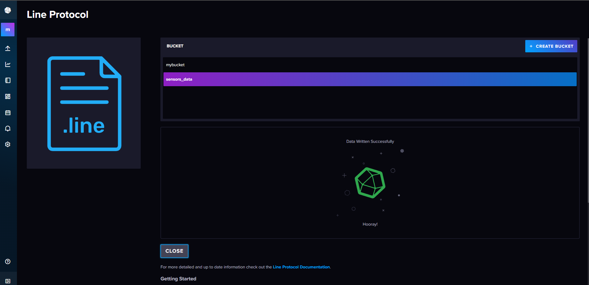
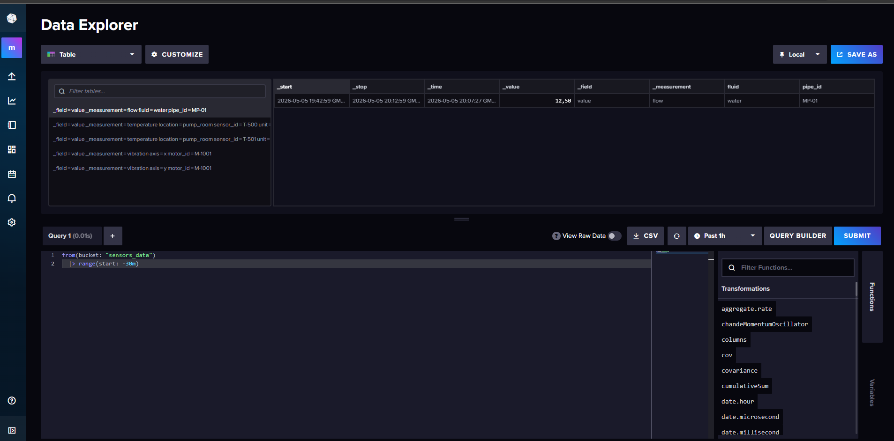
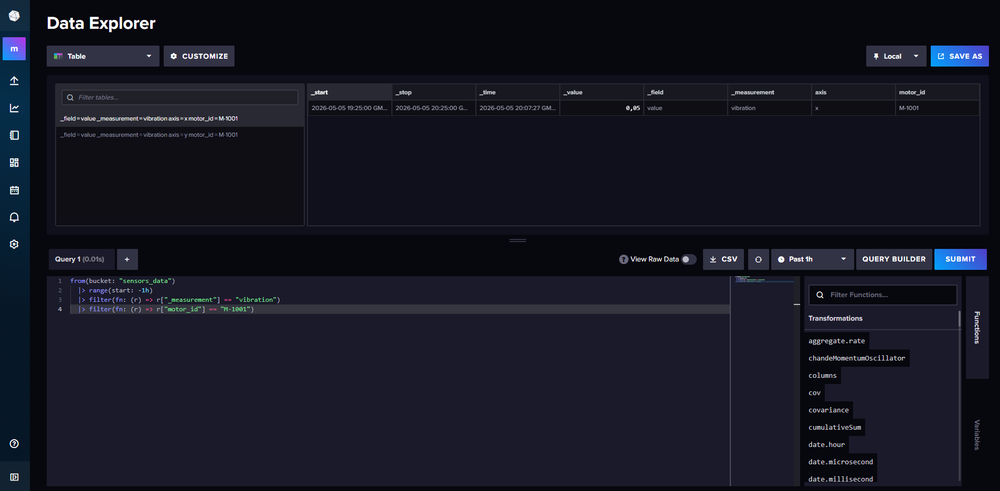
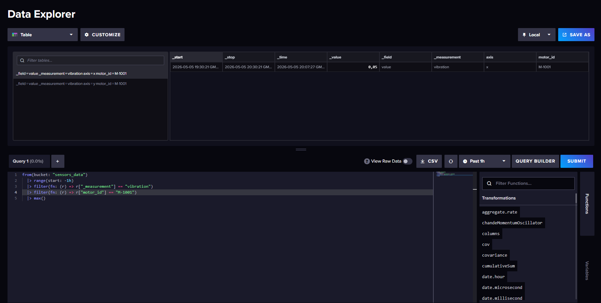
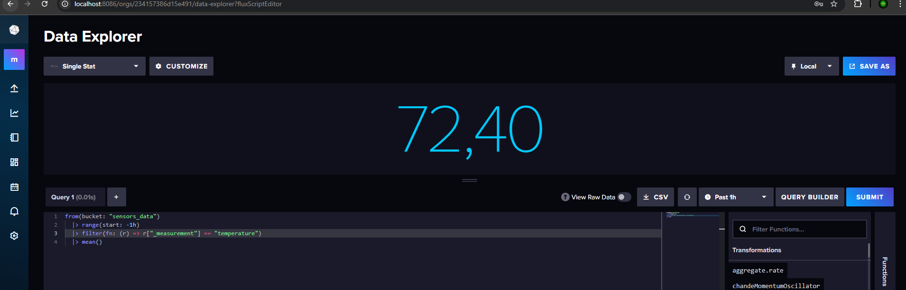
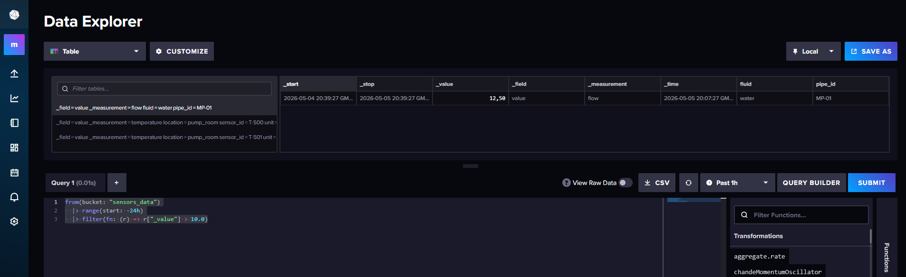
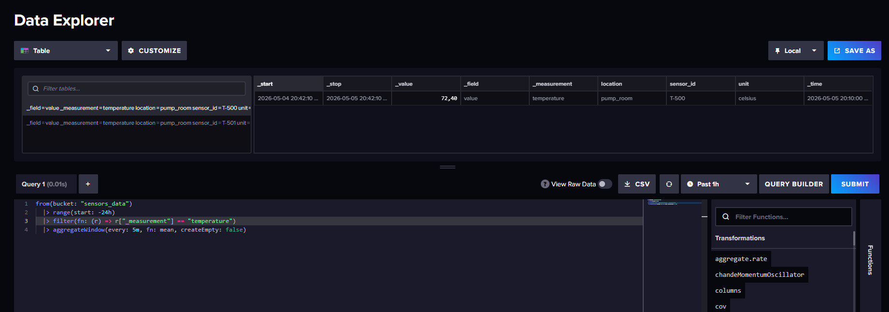
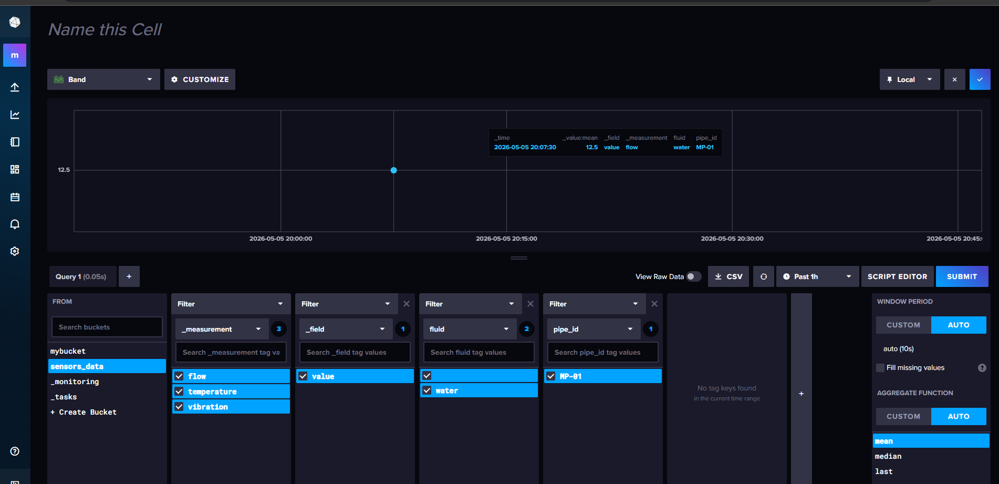

# Задание 1. Установка и запуск InfluxDB

# Задание 2. Создание базы через веб-интерфейс

# Задание 3. Наполнение данными (промышленных) датчиков
```
# Температура подшипников
temperature,sensor_id=T-500,location=pump_room,unit=celsius value=72.4
temperature,sensor_id=T-501,location=pump_room,unit=celsius value=68.1

# Вибрация турбины
vibration,motor_id=M-1001,axis=x value=0.045
vibration,motor_id=M-1001,axis=y value=0.038

# Расход воды в контуре
flow,pipe_id=MP-01,fluid=water value=12.5
```


# Задание 4. Базовые запросы
### Просмотреть все данные за последние 30 минут
```
from(bucket: "sensors_data")
  |> range(start: -30m)
```


### Посмотреть измерения только 1 датчика
```
from(bucket: "sensors_data")
  |> range(start: -1h)
  |> filter(fn: (r) => r["_measurement"] == "vibration")
  |> filter(fn: (r) => r["motor_id"] == "M-1001")
```


### Максимальное значение на 1 датчике
```
from(bucket: "sensors_data")
  |> range(start: -1h)
  |> filter(fn: (r) => r["_measurement"] == "vibration")
  |> filter(fn: (r) => r["motor_id"] == "M-1001")
  |> max()
```


### Среднее значение на датчике
```
from(bucket: "sensors_data")
  |> range(start: -1h)
  |> filter(fn: (r) => r["_measurement"] == "temperature")
  |> filter(fn: (r) => r["sensor_id"] == "T-500")
  |> mean()
```



### Аналитический запрос с фильтром по значению
```
from(bucket: "sensors_data")
  |> range(start: -24h)
  |> filter(fn: (r) => r["_value"] > 10.0)
```



### Запрос на агрегацию данных (среднее по 5-минутным интервалам)
```
from(bucket: "sensors_data")
  |> range(start: -24h)
  |> filter(fn: (r) => r["_measurement"] == "temperature")
  |> aggregateWindow(every: 5m, fn: mean, createEmpty: false)
```



# Задание 5. Создайте Dashboard
