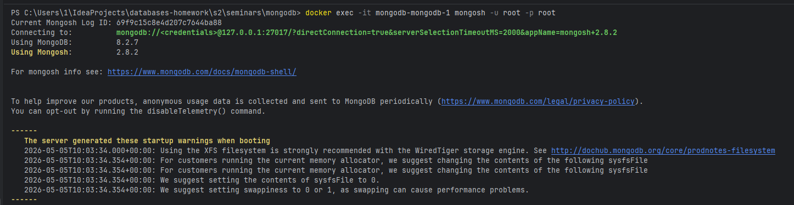
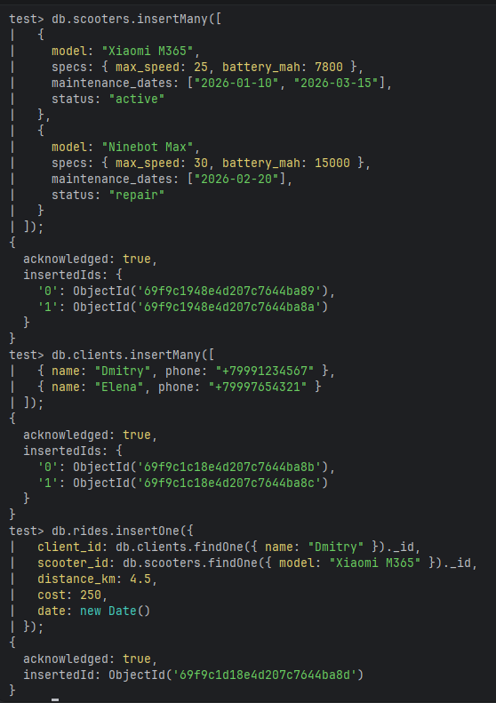
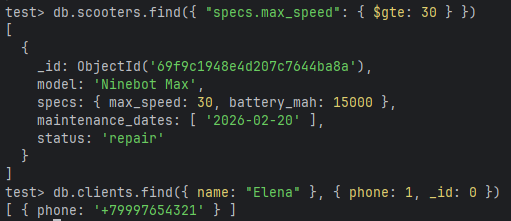
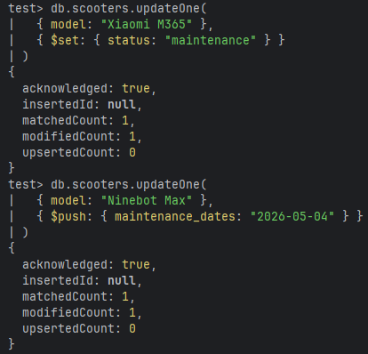
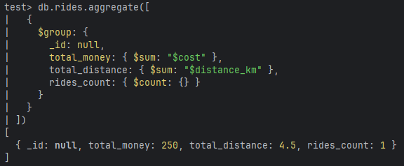

# Задание 1. Создать минимум 3 коллекции, хотя бы 2 из которых связаны `ObjectId`, хотя бы 1 из документов в коллекции хранят JSON объекты либо массивы
```mongodb-json
db.scooters.insertMany([
  { 
    model: "Xiaomi M365", 
    specs: { max_speed: 25, battery_mah: 7800 }, 
    maintenance_dates: ["2026-01-10", "2026-03-15"], 
    status: "active" 
  },
  { 
    model: "Ninebot Max", 
    specs: { max_speed: 30, battery_mah: 15000 }, 
    maintenance_dates: ["2026-02-20"], 
    status: "repair" 
  }
]);

db.clients.insertMany([
  { name: "Dmitry", phone: "+79991234567" },
  { name: "Elena", phone: "+79997654321" }
]);

db.rides.insertOne({
  client_id: db.clients.findOne({ name: "Dmitry" })._id, 
  scooter_id: db.scooters.findOne({ model: "Xiaomi M365" })._id,
  distance_km: 4.5,
  cost: 250,
  date: new Date()
});
```




# Задание 2. Написать 2 find запроса, хотя бы 1 с projection ({ field1: 0, field2: 1})
```mongodb-json
db.scooters.find({ "specs.max_speed": { $gte: 30 } })

db.clients.find({ name: "Elena" }, { phone: 1, _id: 0 })
```



# Задание 3. Написать 2 update запроса (статус - на ремонте)
```mongodb-json
db.scooters.updateOne(
  { model: "Xiaomi M365" }, 
  { $set: { status: "maintenance" } }
)

db.scooters.updateOne(
  { model: "Ninebot Max" }, 
  { $push: { maintenance_dates: "2026-05-04" } }
)
```



# Задание 4. Написать 1 любой запрос с aggregate
```mongodb-json
db.rides.aggregate([
  {
    $group: {
      _id: null, 
      total_money: { $sum: "$cost" },
      total_distance: { $sum: "$distance_km" },
      rides_count: { $count: {} }
    }
  }
])
```


