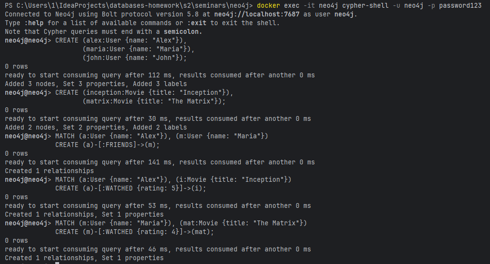
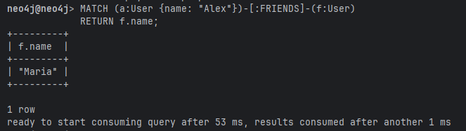
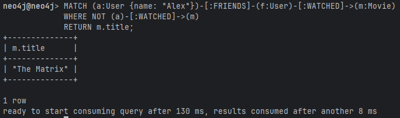
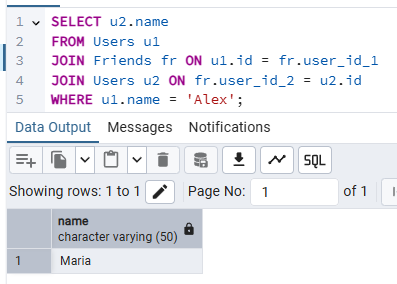
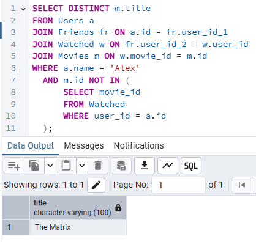

# Задание 1. Создание узлов и связей
```
CREATE (alex:User {name: "Alex"}),
       (maria:User {name: "Maria"}),
       (john:User {name: "John"});

CREATE (inception:Movie {title: "Inception"}),
       (matrix:Movie {title: "The Matrix"});

MATCH (a:User {name: "Alex"}), (m:User {name: "Maria"})
CREATE (a)-[:FRIENDS]->(m);

MATCH (a:User {name: "Alex"}), (i:Movie {title: "Inception"})
CREATE (a)-[:WATCHED {rating: 5}]->(i);

# Добавил связь, чтобы ответ на запрос не был пустым
MATCH (m:User {name: "Maria"}), (mat:Movie {title: "The Matrix"}) 
CREATE (m)-[:WATCHED {rating: 4}]->(mat);
```



# Задание 2. Найти всех друзей Алекса
```
MATCH (a:User {name: "Alex"})-[:FRIENDS]-(f:User)
RETURN f.name;
```



# Задание 3. Найти фильмы, которые смотрели друзья Алекса, но не смотрел сам Алекс
```
MATCH (a:User {name: "Alex"})-[:FRIENDS]-(f:User)-[:WATCHED]->(m:Movie)
WHERE NOT (a)-[:WATCHED]->(m)
RETURN m.title;
```



# Задание 4. Сравнение с SQL.
## Создание таблиц и наполнение их данными
```sql
CREATE TABLE Users (
    id INT PRIMARY KEY,
    name VARCHAR(50) NOT NULL
);

CREATE TABLE Movies (
    id INT PRIMARY KEY,
    title VARCHAR(100) NOT NULL
);

CREATE TABLE Friends (
    user_id_1 INT,
    user_id_2 INT,
    PRIMARY KEY (user_id_1, user_id_2),
    FOREIGN KEY (user_id_1) REFERENCES Users(id),
    FOREIGN KEY (user_id_2) REFERENCES Users(id)
);

CREATE TABLE Watched (
    user_id INT,
    movie_id INT,
    rating INT,
    PRIMARY KEY (user_id, movie_id),
    FOREIGN KEY (user_id) REFERENCES Users(id),
    FOREIGN KEY (movie_id) REFERENCES Movies(id)
);

INSERT INTO Users (id, name) VALUES
    (1, 'Alex'),
    (2, 'Maria'),
    (3, 'John');

INSERT INTO Movies (id, title) VALUES
    (1, 'Inception'),
    (2, 'The Matrix');

INSERT INTO Friends (user_id_1, user_id_2) VALUES
    (1, 2);

INSERT INTO Watched (user_id, movie_id, rating) VALUES
    (1, 1, 5),
    (2, 2, 4);
```

## Запросы
```sql
SELECT u2.name
FROM Users u1
JOIN Friends fr ON u1.id = fr.user_id_1
JOIN Users u2 ON fr.user_id_2 = u2.id
WHERE u1.name = 'Alex';
```



```sql
SELECT DISTINCT m.title
FROM Users a
JOIN Friends fr ON a.id = fr.user_id_1
JOIN Watched w ON fr.user_id_2 = w.user_id
JOIN Movies m ON w.movie_id = m.id
WHERE a.name = 'Alex'
  AND m.id NOT IN (
      SELECT movie_id 
      FROM Watched 
      WHERE user_id = a.id
  );
```


