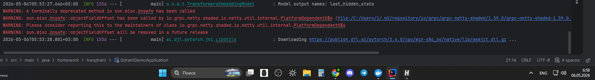

```shell
	at ai.djl.pytorch.engine.PtEngineProvider.getEngine(PtEngineProvider.java:41) ~[pytorch-engine-0.30.0.jar:na]

	at ai.djl.engine.Engine.getEngine(Engine.java:190) ~[api-0.30.0.jar:na]

	at ai.djl.engine.Engine.getInstance(Engine.java:145) ~[api-0.30.0.jar:na]

	at ai.djl.ndarray.NDManager.newBaseManager(NDManager.java:120) ~[api-0.30.0.jar:na]

	at org.springframework.ai.transformers.TransformersEmbeddingModel.lambda$call$3(TransformersEmbeddingModel.java:337) ~[spring-ai-transformers-1.0.0-M6.jar:1.0.0-M6]

	at io.micrometer.observation.Observation.observe(Observation.java:564) ~[micrometer-observation-1.15.3.jar:1.15.3]

	at org.springframework.ai.transformers.TransformersEmbeddingModel.call(TransformersEmbeddingModel.java:298) ~[spring-ai-transformers-1.0.0-M6.jar:1.0.0-M6]

	at org.springframework.ai.transformers.TransformersEmbeddingModel.embed(TransformersEmbeddingModel.java:279) ~[spring-ai-transformers-1.0.0-M6.jar:1.0.0-M6]

	at org.springframework.ai.transformers.TransformersEmbeddingModel.embed(TransformersEmbeddingModel.java:259) ~[spring-ai-transformers-1.0.0-M6.jar:1.0.0-M6]

	at org.springframework.ai.embedding.AbstractEmbeddingModel.dimensions(AbstractEmbeddingModel.java:66) ~[spring-ai-core-1.0.0-M6.jar:1.0.0-M6]

	at org.springframework.ai.embedding.AbstractEmbeddingModel.dimensions(AbstractEmbeddingModel.java:88) ~[spring-ai-core-1.0.0-M6.jar:1.0.0-M6]

	at org.springframework.ai.vectorstore.qdrant.QdrantVectorStore.afterPropertiesSet(QdrantVectorStore.java:319) ~[spring-ai-qdrant-store-1.0.0-M6.jar:1.0.0-M6]

	at org.springframework.beans.factory.support.AbstractAutowireCapableBeanFactory.invokeInitMethods(AbstractAutowireCapableBeanFactory.java:1873) ~[spring-beans-6.2.10.jar:6.2.10]

	at org.springframework.beans.factory.support.AbstractAutowireCapableBeanFactory.initializeBean(AbstractAutowireCapableBeanFactory.java:1822) ~[spring-beans-6.2.10.jar:6.2.10]

	... 36 common frames omitted

Caused by: java.io.EOFException: Unexpected end of ZLIB input stream

	at java.base/java.util.zip.InflaterInputStream.fill(Unknown Source) ~[na:na]

	at java.base/java.util.zip.InflaterInputStream.read(Unknown Source) ~[na:na]

	at java.base/java.util.zip.GZIPInputStream.read(Unknown Source) ~[na:na]

	at java.base/java.io.InputStream.transferTo(Unknown Source) ~[na:na]

	at java.base/java.nio.file.Files.copy(Unknown Source) ~[na:na]

	at ai.djl.pytorch.jni.LibUtils.downloadPyTorch(LibUtils.java:496) ~[pytorch-engine-0.30.0.jar:na]

	... 54 common frames omitted
```

