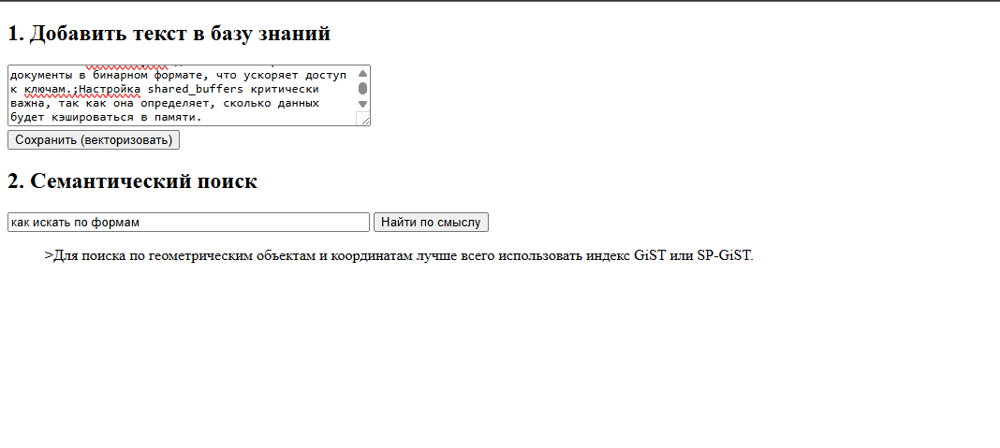
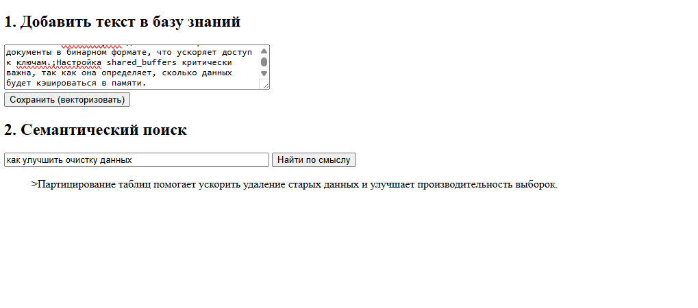
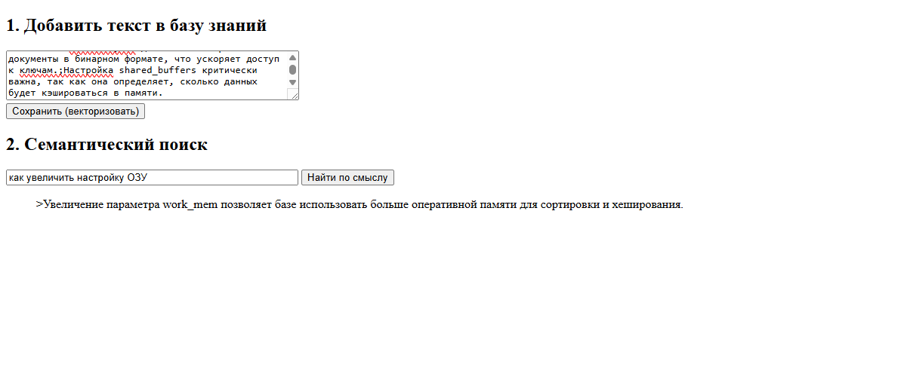
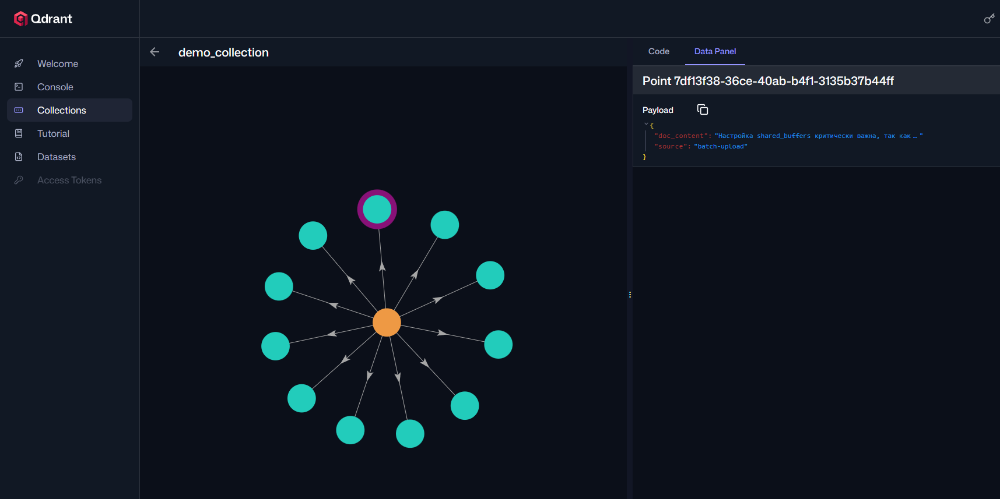
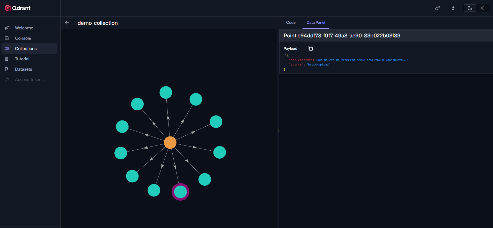

# Задания 5 и 6. В поле добавления ввести текст. Попробовать семантический поиск.
* как искать по формам

* как улучшить очистку данных

* как увеличить настройку ОЗУ

# Задание 7. Перейти на http://localhost:6333/dashboard#/collections/demo_collection/graph и запустить пример кода справа с LIMIT 15 и посмотреть как выглядят данные

