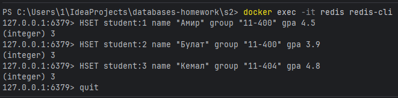
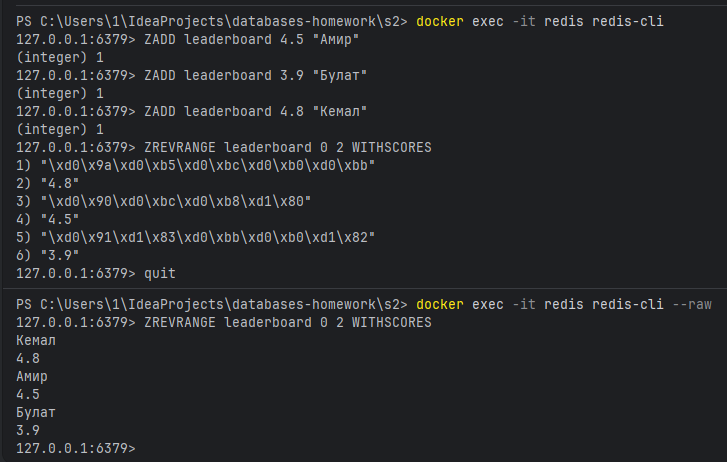
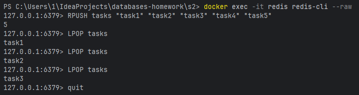
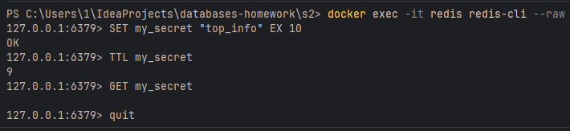
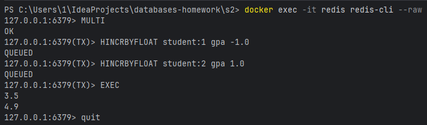

# Задание 1. Hash — данные о студентах
```redis
HSET student:1 name "Амир" group "11-400" gpa 4.5
HSET student:2 name "Булат" group "11-400" gpa 3.9
HSET student:3 name "Кемал" group "11-404" gpa 4.8
```



# Задание 2. Sorted Set — лидерборд по GPA
```redis
ZADD leaderboard 4.5 "Амир"
ZADD leaderboard 3.9 "Булат"
ZADD leaderboard 4.8 "Кемал"
ZREVRANGE leaderboard 0 2 WITHSCORES
```



# Задание 3. List — очередь задач
```redis
RPUSH tasks "task1" "task2" "task3" "task4" "task5"
LPOP tasks
LPOP tasks
LPOP tasks
```



# Задание 4. TTL — время жизни ключа
```redis
SET my_secret "top_info" EX 10
TTL my_secret
# Через 10 секунд
GET my_secret
```


# Задание 5. Транзакция MULTI/EXEC
```redis
MULTI
HINCRBYFLOAT student:1 gpa -1.0
HINCRBYFLOAT student:2 gpa 1.0
EXEC
```

