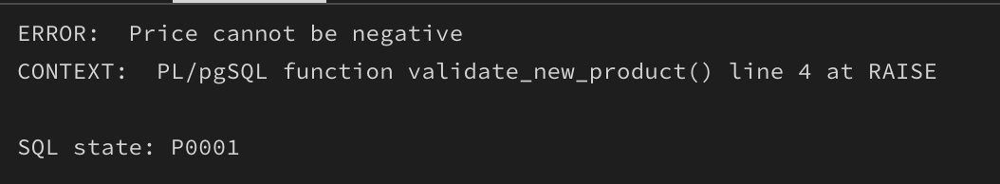
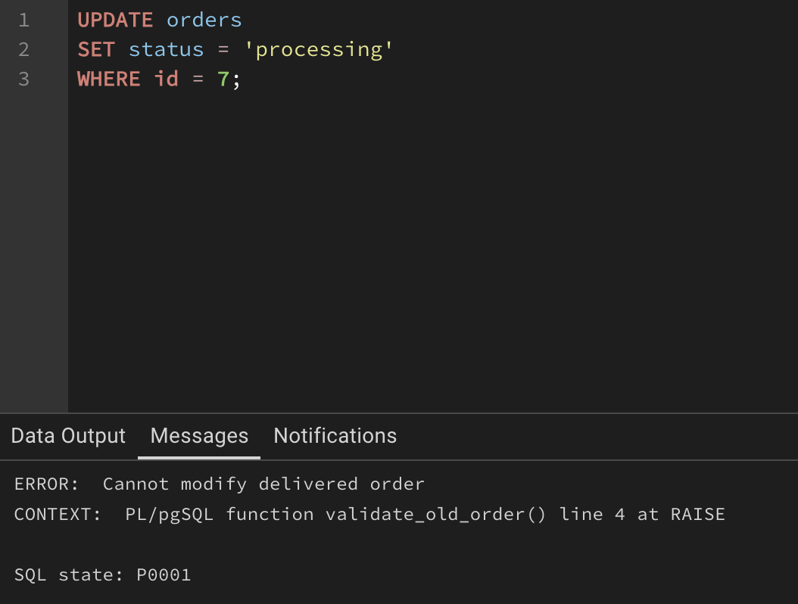
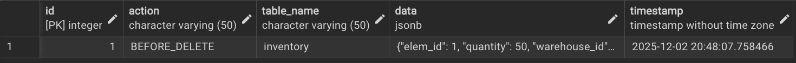
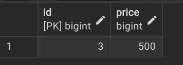
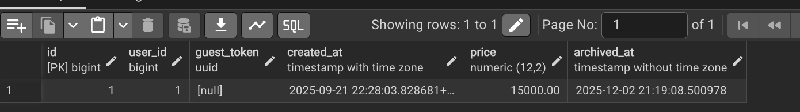
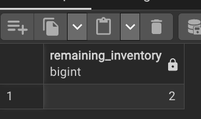
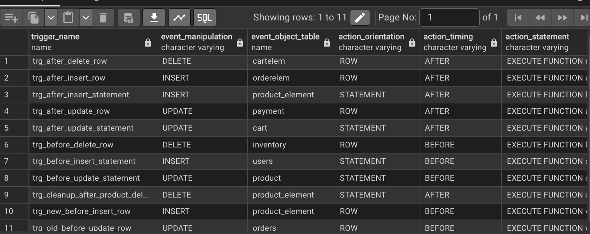
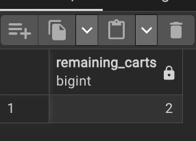
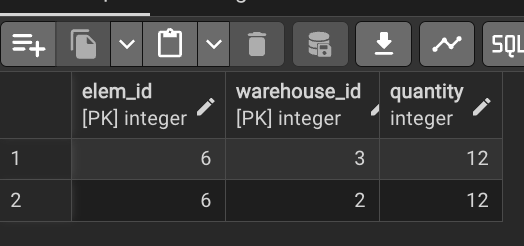
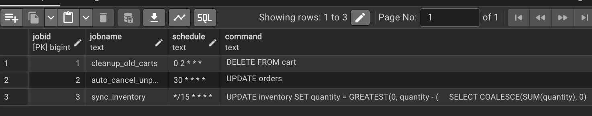

# Триггеры и Кроны для E-commerce системы

## 1. Триггеры (NEW, OLD, BEFORE, AFTER, Row level, statement level)

### 1.1.

**Триггер NEW BEFORE INSERT Row Level**
Создан для валидации новых элементов продукции перед вставкой. Проверяет, что цена не отрицательная.

```sql
CREATE FUNCTION validate_new_product()
RETURNS TRIGGER AS $$
BEGIN
    IF NEW.price < 0 THEN
        RAISE EXCEPTION 'Price cannot be negative';
    END IF;
    RETURN NEW;
END;
$$ LANGUAGE plpgsql;

CREATE TRIGGER trg_new_before_insert_row
BEFORE INSERT ON product_element
FOR EACH ROW
EXECUTE FUNCTION validate_new_product();

INSERT INTO product_element (product_id, article_num, color, price, attributes)
VALUES (1, 12345, 'red', -100, '{"size": "M"}');
```



---

### 1.2.

**Триггер OLD BEFORE UPDATE Row Level**
Создан для защиты уже доставленных заказов от изменений.

```sql
CREATE FUNCTION validate_old_order()
RETURNS TRIGGER AS $$
BEGIN
    IF OLD.status = 'delivered' AND NEW.status != 'delivered' THEN
        RAISE EXCEPTION 'Cannot modify delivered order';
    END IF;
    RETURN NEW;
END;
$$ LANGUAGE plpgsql;

CREATE TRIGGER trg_old_before_update_row
BEFORE UPDATE ON orders
FOR EACH ROW
EXECUTE FUNCTION validate_old_order();

UPDATE orders
SET status = 'processing'
WHERE id = 7 and status = 'delivered';
```



---

### 1.3.

**Триггер BEFORE DELETE Row Level**
Создан для логирования всех удалений из инвентаря перед их выполнением. Сохраняет старые данные в таблицу аудита.

```sql
CREATE FUNCTION log_before_delete()
RETURNS TRIGGER AS $$
BEGIN
    INSERT INTO audit_log (action, table_name, data)
    VALUES ('BEFORE_DELETE', 'inventory', row_to_json(OLD));
    RETURN OLD;
END;
$$ LANGUAGE plpgsql;

CREATE TRIGGER trg_before_delete_row
BEFORE DELETE ON inventory
FOR EACH ROW
EXECUTE FUNCTION log_before_delete();

DELETE FROM inventory
WHERE elem_id = 1 AND warehouse_id = 1;

SELECT * FROM audit_log WHERE action = 'BEFORE_DELETE' ORDER BY timestamp DESC LIMIT 5;
```



---

### 1.4.

**Триггер AFTER INSERT Row Level**
Создан для автоматического обновления общей суммы заказа при добавлении нового элемента в заказ. Пересчитывает total_price в таблице orders.

```sql
CREATE OR REPLACE FUNCTION update_order_total()
RETURNS TRIGGER AS $$
DECLARE
    item_total NUMERIC(10, 2);
BEGIN
    item_total := NEW.quantity * NEW.unit_price;

    UPDATE orders
    SET price = price + item_total
    WHERE id = NEW.order_id;

    RETURN NEW;
END;
$$ LANGUAGE plpgsql;

CREATE TRIGGER trg_after_insert_row
AFTER INSERT ON orderelem
FOR EACH ROW
EXECUTE FUNCTION update_order_total();

INSERT INTO orderelem (order_id, elem_id, quantity, unit_price)
VALUES (3, 6, 2, 50.00);

SELECT id, price FROM orders WHERE id = 3;
```




---

### 1.5.

**Триггер AFTER UPDATE Row Level**
Создан для автоматического обновления статуса заказа при успешной оплате. При изменении статуса платежа на 'completed' заказ переходит в статус 'processing'.

```sql
CREATE FUNCTION update_order_status()
RETURNS TRIGGER AS $$
BEGIN
    IF NEW.status = 'completed' THEN
        UPDATE orders SET status = 'processing' WHERE id = NEW.order_id;
    END IF;
    RETURN NEW;
END;
$$ LANGUAGE plpgsql;

CREATE TRIGGER trg_after_update_row
AFTER UPDATE ON payment
FOR EACH ROW
WHEN (OLD.status != NEW.status)
EXECUTE FUNCTION update_order_status();

UPDATE payment
SET status = 'completed', paid_at = NOW()
WHERE order_id = 1 AND status = 'pending';

SELECT id, status FROM orders WHERE id = 1;
```


---

### 1.6.

**Триггер AFTER DELETE Row Level**
Создан для автоматического пересчета цены корзины при удалении товара из неё. Пересчитывает сумму оставшихся товаров.

```sql
CREATE FUNCTION recalculate_cart()
RETURNS TRIGGER AS $$
BEGIN
    UPDATE cart
    SET price = (
        SELECT COALESCE(SUM(pe.price * ce.quantity), 0)
        FROM cartelem ce
        JOIN product_element pe ON ce.elem_id = pe.id
        WHERE ce.cart_id = OLD.cart_id
    )
    WHERE id = OLD.cart_id;
    RETURN OLD;
END;
$$ LANGUAGE plpgsql;


CREATE TRIGGER trg_after_delete_row
AFTER DELETE ON cartelem
FOR EACH ROW
EXECUTE FUNCTION recalculate_cart();

DELETE FROM cartelem WHERE cart_id = 1 AND elem_id = 1;

SELECT id, price FROM cart WHERE id = 1;
```


---

### 1.7.

**Триггер BEFORE INSERT Statement Level**
Создан для контроля массовой вставки пользователей. Выводит сообщение при начале массовой операции вставки.

```sql
CREATE FUNCTION check_insert_quota()
RETURNS TRIGGER AS $$
BEGIN
    RAISE NOTICE 'Bulk insert started at %', NOW();
    RETURN NULL;
END;
$$ LANGUAGE plpgsql;

CREATE TRIGGER trg_before_insert_statement
BEFORE INSERT ON users
FOR EACH STATEMENT
EXECUTE FUNCTION check_insert_quota();

INSERT INTO users (name, login, password, role_id)
VALUES
    ('User1', 'user1', 'pass123', 1),
    ('User2', 'user2', 'pass456', 1),
    ('User3', 'user3', 'pass789', 1);
```


---

### 1.8.

**Триггер BEFORE UPDATE Statement Level**
Создан для отслеживания массовых обновлений товаров. Выводит уведомление при начале массовой операции обновления.

```sql
CREATE FUNCTION check_bulk_update()
RETURNS TRIGGER AS $$
BEGIN
    RAISE NOTICE 'Bulk update started at %', NOW();
    RETURN NULL;
END;
$$ LANGUAGE plpgsql;

CREATE TRIGGER trg_before_update_statement
BEFORE UPDATE ON product
FOR EACH STATEMENT
EXECUTE FUNCTION check_bulk_update();

UPDATE product
SET characteristics = '{"color": "blue"}'::jsonb
WHERE category_id = 1;

SELECT id, name FROM product WHERE category_id = 1 LIMIT 5;
```


---

### 1.9.

**Триггер BEFORE DELETE Statement Level**
Создан для полной защиты таблицы заказов от удаления. Предотвращает любые попытки удаления заказов из БД.

```sql
CREATE FUNCTION prevent_delete()
RETURNS TRIGGER AS $$
BEGIN
    RAISE EXCEPTION 'Cannot delete orders';
END;
$$ LANGUAGE plpgsql;

CREATE TRIGGER trg_before_delete_statement
BEFORE DELETE ON orders
FOR EACH STATEMENT
EXECUTE FUNCTION prevent_delete();

DELETE FROM orders WHERE id = 999;
```


---

### 1.10.

**Триггер AFTER INSERT Statement Level**
Создан для логирования массовых вставок элементов продукции. Записывает информацию о завершении операции вставки в журнал.

```sql
CREATE FUNCTION log_insert_batch()
RETURNS TRIGGER AS $$
BEGIN
    INSERT INTO system_log (action, message)
    VALUES ('BATCH_INSERT', 'Product elements inserted at ' || NOW());
    RETURN NULL;
END;
$$ LANGUAGE plpgsql;

CREATE TRIGGER trg_after_insert_statement
AFTER INSERT ON product_element
FOR EACH STATEMENT
EXECUTE FUNCTION log_insert_batch();

INSERT INTO product_element (product_id, article_num, color, price)
VALUES
    (1, 54321, 'green', 150),
    (2, 54322, 'blue', 200);

SELECT * FROM system_log WHERE action = 'BATCH_INSERT' ORDER BY timestamp DESC LIMIT 3;
```


---

### 1.11.

**Триггер AFTER UPDATE Statement Level**
Создан для архивирования дорогих корзин после их обновления. Автоматически перемещает старые корзины стоимостью более 10000 в таблицу архива.

```sql
CREATE FUNCTION archive_carts()
RETURNS TRIGGER AS $$
BEGIN
    INSERT INTO cart_archive
    SELECT * FROM cart
    WHERE price > 10000 AND created_at < NOW() - INTERVAL '7 days';
    RETURN NULL;
END;
$$ LANGUAGE plpgsql;

CREATE TRIGGER trg_after_update_statement
AFTER UPDATE ON cart
FOR EACH STATEMENT
EXECUTE FUNCTION archive_carts();

UPDATE cart
SET price = 15000
WHERE price > 5000 AND user_id IS NOT NULL;

SELECT * FROM cart_archive ORDER BY archived_at DESC LIMIT 5;
```



---

### 1.12.

**Триггер AFTER DELETE Statement Level**
Создан для очистки сирот в таблице инвентаря. После удаления товаров удаляет записи инвентаря, которые больше не связаны с существующими товарами.

```sql
CREATE OR REPLACE FUNCTION cleanup_orphaned()
RETURNS TRIGGER AS $$
BEGIN
    DELETE FROM inventory
    WHERE elem_id NOT IN (SELECT id FROM product_element);
    RETURN NULL;
END;
$$ LANGUAGE plpgsql;

CREATE TRIGGER trg_cleanup_after_product_delete
AFTER DELETE ON product_element
FOR EACH STATEMENT
EXECUTE FUNCTION cleanup_orphaned();

DELETE FROM inventory
WHERE warehouse_id = 1;

SELECT COUNT(*) AS remaining_inventory FROM inventory;
```



---

## 2. Отображение списка триггеров

### 2.1.

```sql
SELECT
    trigger_name,
    event_manipulation,
    event_object_table,
    action_orientation,
    action_timing,
    action_statement
FROM information_schema.triggers
WHERE trigger_schema = 'public'
ORDER BY trigger_name;
```



---

## 3. Кроны

### 3.1. Крон 1 - Очистка старых корзин

**Назначение крона:** Автоматическое удаление неактивных гостевых корзин, которые не были использованы более 30 дней. Помогает освободить место в БД и улучшить производительность.

```sql
CREATE EXTENSION IF NOT EXISTS pg_cron;

SELECT cron.schedule('cleanup_old_carts', '0 2 * * *',
$$DELETE FROM cart
WHERE created_at < NOW() - INTERVAL '30 days'
AND user_id IS NULL$$);

DELETE FROM cart
WHERE created_at < NOW() - INTERVAL '30 days'
AND user_id IS NULL;

SELECT COUNT(*) AS remaining_carts FROM cart;
```



---

### 3.2. Крон 2 - Отмена неоплаченных заказов

**Назначение крона:** Автоматическая отмена заказов, которые ожидают оплаты более 2 часов. Предотвращает зависание заказов и освобождает зарезервированный инвентарь.

```sql
SELECT cron.schedule('auto_cancel_unpaid', '1 * * * *',
$$UPDATE orders
SET status = 'cancelled'
WHERE status = 'pending'
AND created_at < NOW() - INTERVAL '2 hours'
AND id NOT IN (
    SELECT order_id FROM payment WHERE status = 'completed'
)$$);

UPDATE orders
SET status = 'cancelled'
WHERE status = 'pending'
AND created_at < NOW() - INTERVAL '2 hours'
AND id NOT IN (
    SELECT order_id FROM payment WHERE status = 'completed'
);

SELECT status, COUNT(*) FROM orders GROUP BY status;
```


---

### 3.3. Крон 3 - Синхронизация инвентаря

**Назначение крона:** Периодическая синхронизация остатков инвентаря с обработанными заказами. Уменьшает количество товара на складе на основе товаров в статусе 'processing'.

```sql
SELECT cron.schedule('sync_inventory', '*/15 * * * *',
$$UPDATE inventory
SET quantity = GREATEST(0, quantity - (
    SELECT COALESCE(SUM(quantity), 0)
    FROM orderelem
    WHERE elem_id = inventory.elem_id
    AND order_id IN (
        SELECT id FROM orders
        WHERE status = 'processing'
    )
))
WHERE quantity > 0$$);

UPDATE inventory
SET quantity = GREATEST(0, quantity - (
    SELECT COALESCE(SUM(quantity), 0)
    FROM orderelem
    WHERE elem_id = inventory.elem_id
    AND order_id IN (
        SELECT id FROM orders
        WHERE status = 'processing'
    )
))
WHERE quantity > 0;

SELECT * FROM inventory WHERE quantity > 0 LIMIT 10;
```



---

## 4. Запрос на просмотр кронов

### 4.1. Что хотим получить

```sql
SELECT
    jobid,
    jobname,
    schedule,
    command,
    active
FROM cron.job
ORDER BY jobid;
```



---

## 5. Запрос на просмотр выполнения кронов

### 5.1. Что хотим получить

```sql
SELECT * FROM cron. job_run_details
ORDER BY start_time DESC
LIMIT 10;
```


